# Chapter 1

[TOC]

## Signal Amplification

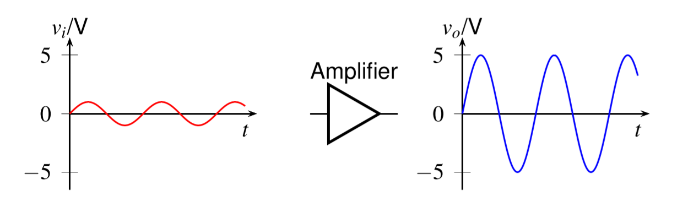

$$
\begin{aligned}
    v_o(t) = C\cdot v_i(t) 
\end{aligned}
$$

- $v_i(t)$: input signal
- $v_o(t)$: output signal
- $A$: **amplifier gain**

### Case 1: Signal Transmission

A small signal need to be transmitted from a sender to a receiver through a wired channel

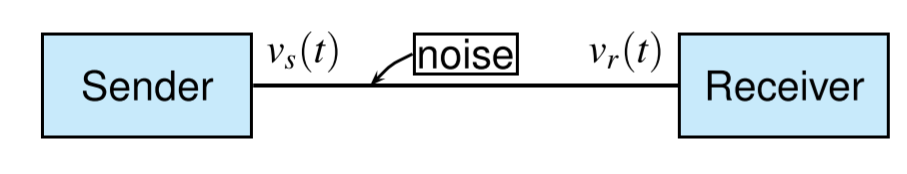

It could be hard to be finished because the transmitting channels are noisy. Let $v_n(t)$ denote the noise voltage, then $v_r(t)=v_s(t)+v_n(t)$

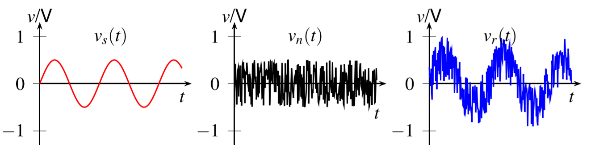

If the signal is amplified before transmission

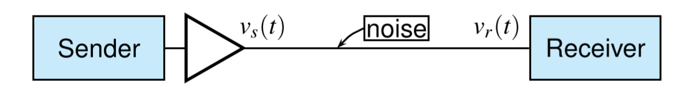

Then it could be easier to identify the receive voltage

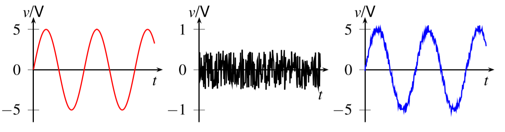

### Case 2: Digital Mobile Phone

The signal processing subsystem in a digital mobile phone

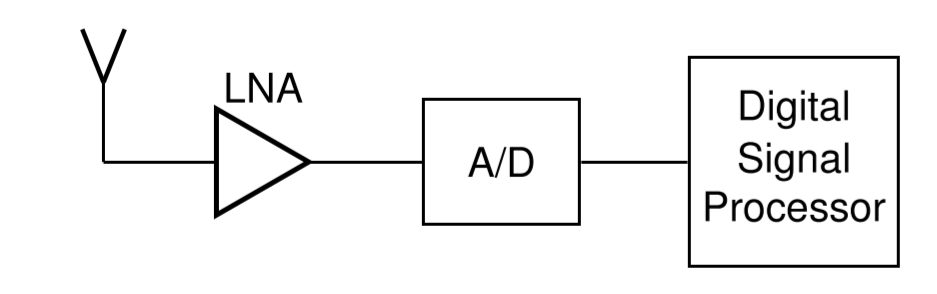

- LNA: low noise amplifier
- A/D: analog to digital converter

Since the signal received by antenna is too weak, which is usually in $\mu V$ range, while the A/D converter required the input signal with the range from 0 to 3.3 V.

The processing could be much easier if the signal magnitude is larger.

## Amplifiers

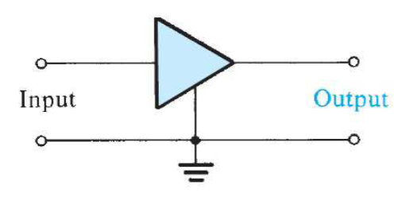

The signal amplifier is a two-port network and only **dependent sources** could be used to realize amplifiers

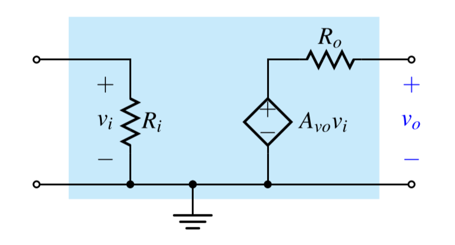

- $R_i$: input resistance
- $R_o$: output resistance
- $A_{vo}$: **open-circuit** voltage gain

### Different Amplifiers

|            Type            |                    Circuit Model                    |       Gain Parameter       |    Ideal Characteristics     |
| :------------------------: | :-------------------------------------------------: | :------------------------: | :--------------------------: |
|     Voltage Amplifier      |      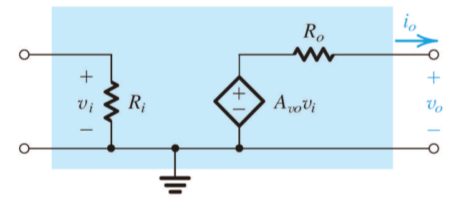      | $A_{vo} = \frac{v_o}{v_i}$ |   $R_i = \infty, R_o = 0$    |
|     Current Amplifier      |     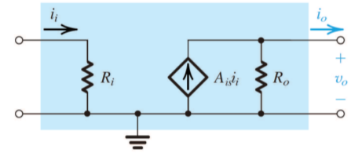      | $A_{is} = \frac{i_o}{i_i}$ |   $R_i = 0, R_o = \infty$    |
| Transconductance Amplifier | 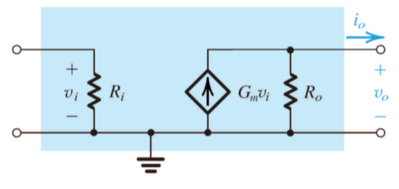 |  $G_m = \frac{i_o}{v_i}$   | $R_i = \infty, R_o = \infty$ |
| Transresistance Amplifier  | 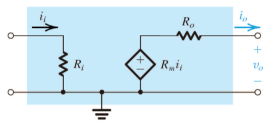  |  $R_m = \frac{v_o}{i_i}$   |      $R_i = 0, R_o = 0$      |

### Amplifier Power Efficiency

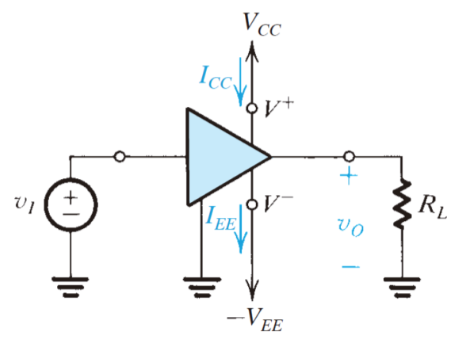

The DC power delivered to the amplifier is

$$
P_{dc} = V_{CC}I_{CC}+V_{EE}I_{EE}
$$

The power-balance equation over the circuit is

$$
P_{dc} +P_I = P_L+P_{\text{dissipated}}
$$

The amplifier power efficiency is

$$
\eta = \frac{P_L}{P_{dc}}\times 100\%
$$

### Characters of Amplifiers

There are several important parameter of amplifiers:

- $A$: Gain
- $R_i$: Input Resistance
- $R_o$: Output Resistance

#### Amplifier Gain

A voltage amplifier fed with a signal $v_i(t)$ and connected to a load resistance $R_L$

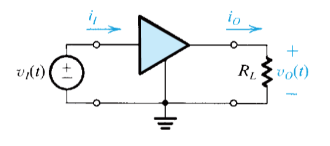

- Voltage Gain: $A_v=\frac{v_o}{v_i}$
- Current Gain: $A_i=\frac{i_o}{i_i}$
- Power Gain: $A_p=\frac{v_o i_o}{v_i i_i}$

And there is relationship between power gain, voltage gain and current gain is

$$
A_p = A_oA_i
$$

And electronics engineers prefer to express amplifier gain with **logarithmic measure**

- Voltage Gain in decibels: $20\log\|A_v\|\;dB$
- Current Gain in decibels: $20\log\|A_i\|\;dB$
- Power Gain in decibels: $10\log\|A_p\|\;dB$

#### Input and Output Resistance

The input resistance $R_i$ is **an equivalent resistance** that accounts for the fact that the amplifier draws an input current from the signal source

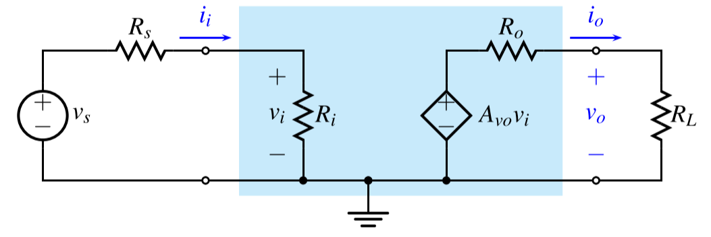

$$
v_i = v_s \frac{R_i}{R_i+R_s}
$$

A **voltage amplifier** with ***larger input resistance*** draw less current from the signal source, and its $v_i$ is closer to $v_s$

$$
v_o = A_{vo}v_i \frac{R_L}{R_L+R_o}
$$

A **voltage amplifier** with ***smaller output resistance*** has stronger ability to drive a heavy load

#### Determine Input and Output Resistance

- Determine $R_i$: by applying an **input voltage** $v_i$ and calculating the **input current** $i_i$
  
$$
R_i = \frac{v_i}{i_i}
$$

- Determine $R_o$: by finding ratio of the **open-circuit output voltage** to the **short-circuit output current**

### Overall Gain

- Voltage Gain
$$
A_v = \frac{v_o}{v_i} = A_{vo}\cdot \frac{R_L}{R_L+R_o}
$$
- Overall Gain
$$
\frac{v_o}{v_s} = A_{vo}\cdot\frac{R_i}{R_i+R_s}\frac{R_L}{R_L+R_o}
$$

### Characterizing Amplifiers

A perfect **voltage amplifier** should have

- large input resistance
- small output resistance
- a gain that is controllable ina wide range
