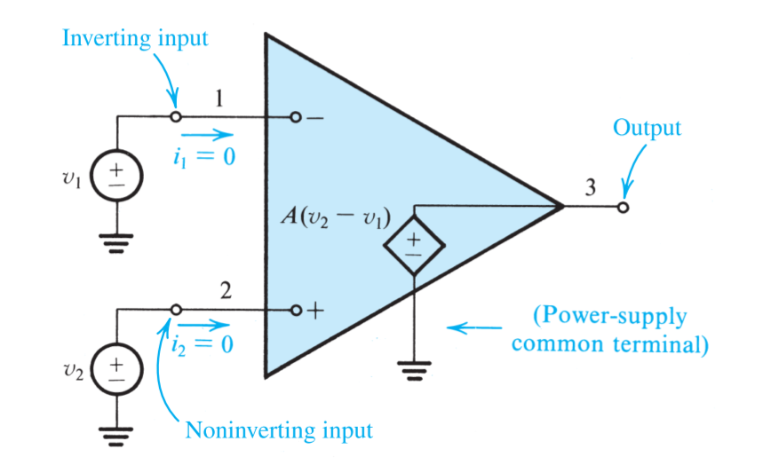
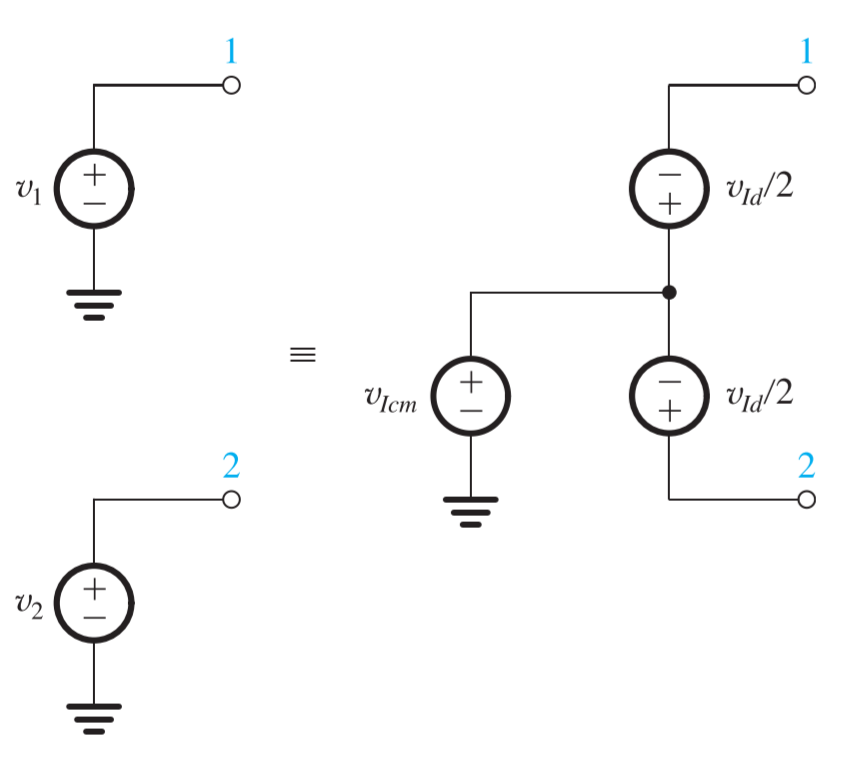
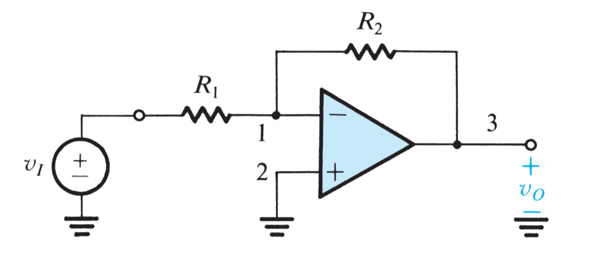
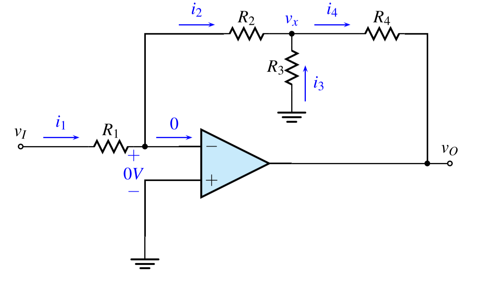

# Chapter 2

[TOC]

## 2-1 Ideal Op Amp

### Models of Ideal Op Amp

From a signal point of view the op amp has three terminals: two inputs and one output terminal

|  Pin  |    Terminal    |
| :---: | :------------: |
|   1   | Negative Input |
|   2   | Positive Input |
|   3   |     Output     |

Most IC op amp have 5 terminals: two inputs, one output and two DC power terminals

|  Pin  |    Terminal    |
| :---: | :------------: |
|   1   | Negative Input |
|   2   | Positive Input |
|   3   |     Output     |
|   4   | Positive Power |
|   5   | Negative Power |

### Function and Characteristics of the Ideal Op Amp

- Infinite input impedance
- Zero output impedance
- Zero [common-mode gain](#differential-and-common-mode-signals)
- Infinite open-loop gain A
- Infinite bandwidth

### Differential and Common-Mode Signals

The differential input signal $v_{Id}$ is simply the difference between the two input signals $v_1$ and $v_2$

$$
v_{Id} = v_2-v_1
$$

The common-mode input signal $v_{Icm}$ is the average of the two input signals $v_1$ and $v_2$

$$
v_{Icm} = \frac{1}{2}(v_1+v_2)
$$

Made the equation express $v_1$ and $v_2$ as

$$
\begin{cases}
    v_1 = v_{Icm}-v_{Id}/2\\[2ex]
    v_2 = v_{Icm}+v_{Id}/2
\end{cases}
$$

which could turn the input terminals into another presentation

### Analysis Method

There are tree rules to analyze the op amp circuit

- ==**virtual short**==: $v_+=v_-$
- ==**virtual open**==: $i_+=0,i_-=0$
- ==**zero output resistance**==: $R_O=0$

## 2-2 Inverting Amplifier

The **closed-loop gain** G could be determined as

$$
G = \frac{v_O}{v_I}
$$

Since $v_-=v_+=0$

$$
i_1 = \frac{v_I-0}{R_1}=\frac{v_I}{R_1}\quad i_2 = \frac{0-v_O}{R_2} = -\frac{v_O}{R_2}
$$

And we have $i_1=i_2$

$$
\begin{aligned}
    \frac{v_I}{R_1} &= - \frac{v_O}{R_2}\\[2ex]
    \frac{v_O}{v_I} &= -\frac{R_2}{R_1}
\end{aligned}
$$

- gain: $R_2/R_1$
- input resistance: $R_1$
- output resistance: $R_O = 0$

### T-shape Feedback Network

Since $v_-=v_+=0$

$$
i_1 = \frac{v_I-0}{R_1} = \frac{v_I}{R_1}
$$

And we have $i_1=i_2$

$$
v_x = i_2R_2 = i_1 R_2 = \frac{R_2}{R_1}v_I
$$

Therefore $i_3$ could be determined as

$$
i_3 = \frac{v_x}{R_3} = \frac{R_2}{R_1}\cdot\frac{v_I}{R_3}
$$

The output voltage could be calculated 

$$
\begin{aligned}
    v_o &= v_x+i_4R_4\\[2ex] 
        &= \frac{R_2}{R_1}v_I+(i_2+i_3)R_4\\[2ex]
        &= \frac{R_2}{R_1}v_I+(i_1+i_3)R_4\\[2ex]
        &= \frac{R_2}{R_1}v_I+(\frac{1}{R_1}+\frac{R_2}{R_1}\cdot\frac{1}{R_3})v_I R_4\\[2ex]
        &= (\frac{R_2}{R_1}+\frac{R_4}{R_1}+\frac{R_2}{R_1}\frac{R_4}{R_3})v_I\\[2ex]
\end{aligned}
$$

## 2-3 Noninverting Amplifier

The **closed-loop gain** G could be determined as

$$
G = \frac{v_O}{v_I}
$$

Since $v_-=v_+=v_1$

$$
i_1 = \frac{v_I-0}{R_1}=\frac{v_I}{R_1}\quad i_2 = \frac{v_O-v_I}{R_2}
$$

And we have $i_1=i_2$

$$
\begin{aligned}
    \frac{v_I}{R_1} &= \frac{v_O-v_I}{R_2}\\[2ex]
    (R_1+R_2)v_I &= R_1 v_O\\[2ex]
    \frac{v_O}{v_I} &=(1+\frac{R_2}{R_1})
\end{aligned}
$$

- gain: $1+\frac{R_2}{R_1}$
- input resistance: $R_I = \infty$
- output resistance: $R_O = 0$

## 2-4 Difference Amplifier

A difference amplifier is one that responds to the difference between the two signals applied at its input and ideally rejects signals that are common to the two inputs.

Take the following two amplifiers into consideration

$$
v_{O1} = -\frac{R_2}{R_1}v_{I1}\qquad v_{O2} = (1+\frac{R_2}{R_1})\frac{R_4}{R_3+R_4}v_{I2}
$$

To produce no response to the common part, which means $v_{I1} = v_{I2}$

$$
\begin{aligned}
    v_{O1}+v_{O2} &= 0\\[1ex]
    \frac{R_2}{R_1}v_{I1} &= (1+\frac{R_2}{R_1})\frac{R_4}{R_3+R_4}v_{I2}\\[2ex]
    \frac{R_2}{R_1}\cdot \frac{R_1}{R_1+R_2} &= \frac{R_4}{R_3+R_4}\\[3ex]
    \frac{R_4}{R_2} &= \frac{R_3}{R_1}
\end{aligned}
$$

Now the common difference amplifier could be analyzed in the same way

The voltage on the input terminals could be determined as

$$
\frac{R_4}{R_3+R_4}v_{Icm}
$$

The current on $R_1$ is

$$
i_1 = \frac{R_3}{R_1} \frac{1}{R_3+R_4}v_{Icm}
$$

And we know $i_1=i_2$

$$
\begin{aligned}
    v_O &= \frac{R_4}{R_3+R_4}v_{Icm}-\frac{R_3}{R_1}\frac{R_2}{R_3+R_4}v_{Icm}\\[2ex]
    &= \frac{v_{Icm}}{R_3+R_4}(R_4-\frac{R_3}{R_1}R_2)\\[2ex]
    \frac{v_O}{v_{Icm}} &= \frac{R_4}{R_3+R_4}(1-\frac{R_2}{R_1}\frac{R_3}{R_4}) = 0
\end{aligned}
$$

## 2-5 DC Imperfections

### Offset Voltage

If the two input terminals of the op amp are tied together and connected to ground, it will be found that despite the fact thar $v_{Id}=0$, a finite dc voltage exists at the output.

The op-amp output can be brought back to its ideal value of $0\;V$ by connecting a dc voltage source of appropriate polarity and magnitude between the two input terminals of the op amp.

It follows that the **input offset voltage** $V_{OS}$ must be of equal magnitude and of opposite polarity of the voltage

Based on the principle of superposition, we can find the both the inverting and the noninverting amplifier configurations result in the same circuit

The output voltage due to $V_{OS}$ is found to be 

$$
V_O =V_{OS}\Big[1+\frac{R_2}{R_1}\Big]
$$

### Input Bias and Offset Currents

In order for the op amp to operate, its two input terminals have to be supplied with dc currents, termed the **input bias currents**, which are independent og the fact that a real op amp has finite input resistance

The average value $I_B$ is called the **input bias current**

$$
I_B = \frac{I_{B1}+I_{B2}}{2}
$$

and the difference is called the **input offset current** and is given by

$$
I_{OS} = |I_{B1}-I_{B2}|
$$

> Typical values for general-purpose op amps are $I_B = 100 \;nA$ and $I_{OS}=10\; nA$

Now we can analyses the closed loop amplifier, taking into account the input bias currents

$$
V_O = -I_{B2}R_3+R_2(I_{B2}-I_{B2}R_3/R_1)
$$

Consider the case $I_{B1}=I_{B2}=I_B$, which results in

$$
V_O = I_B[R_2-R_3(1+R_2/R_1)]
$$

Thus output voltage could be zero when selecting $R_3$ equal to

$$
R_3 = \frac{R_2}{1+R_2/R_1}=\frac{R_1R_2}{R_1+R_2}
$$

But in an **ac-coupled** amplifier the dc resistance seen by the inverting terminal is $R_2$, then $R_3$ is chosen equal to $R_2$

### Effect of Finite Open-loop Gain

Since the op-amp open-loop gain A is finite

$$
v_+-v_- = \frac{v_O}{A}\Rightarrow v_-=-\frac{v_O}{A}
$$

thus

$$
i_1 = \frac{v_{I}-(-v_O/A)}{R_1}=\frac{v_I+v_O/A}{R_1}
$$

Then the output voltage $v_O$ becomes

$$
v_O = -\frac{v_O}{A}-i_1R_2=-\frac{v_O}{A}-\Big(\frac{v_I+v_O/A}{R_1}\Big)R_2
$$

where the the closed-loop gain is found as

$$
G= \frac{v_O}{v_I} = -\frac{R_2/R_1}{1+(1+R_2/R_1)/A}
$$

Similarly, we could get the closed-loop gain for the noninverting amplifier

$$
G= \frac{v_O}{v_I} = \frac{1+(R_2/R_1)}{1+(1+R_2/R_1)/A}
$$
