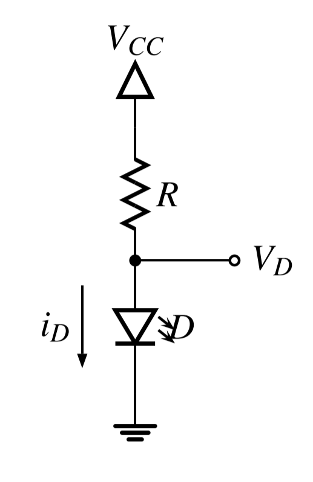
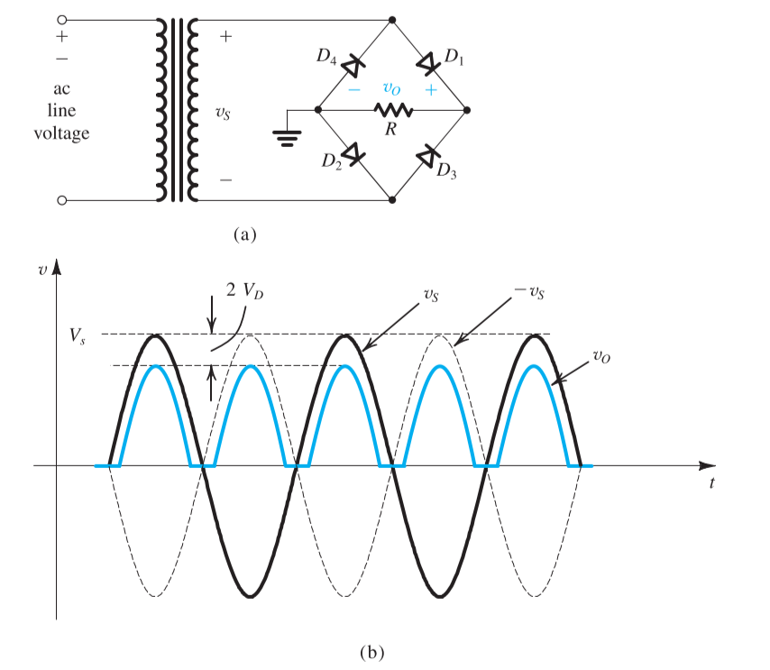
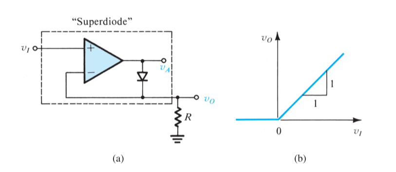
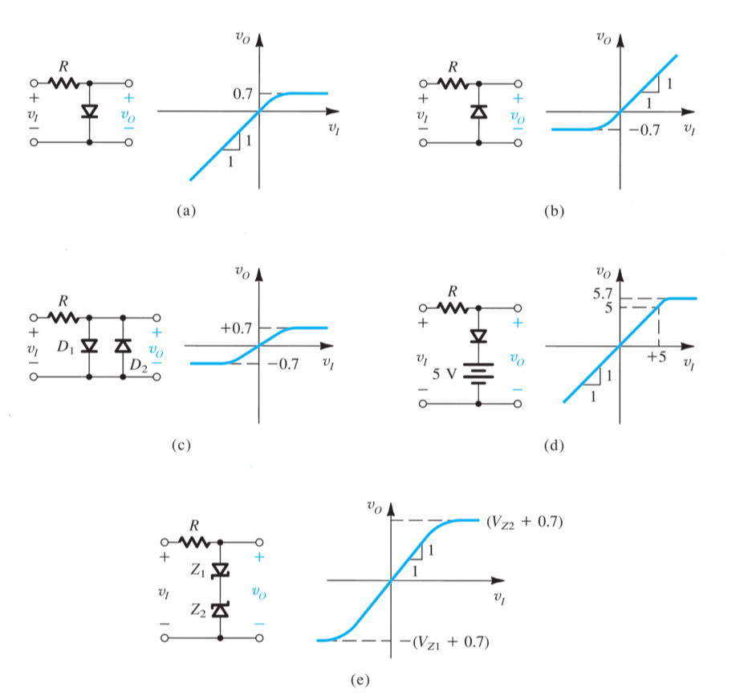
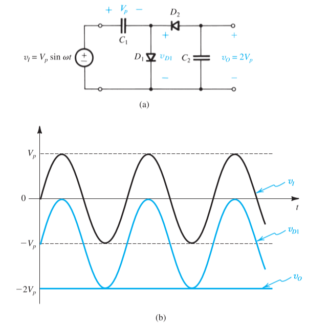

# Chapter 3

## 3-1 Ideal Diode

The **ideal diode** may be considered to be the most fundamental ==nonlinear== circuit element, which has two nodes:

- **anode**: the positive terminal
- **cathode**: the negative terminal

If a negative voltage is applied

- no current flows
- reverse biased
- **cut off**

If a positive current is applied

- zero voltage drop
- forward biased
- **turn on**

### A simple Application: The Rectifier

### Another Application: Diode Logic Gates

For the figure (a), the circuit implements with the **logic OR function**

$$
Y = A+B+C
$$

For the figure (b), the circuit implements with the **logic AND function**

$$
Y = A\cdot B\cdot C
$$

### The Constant-Voltage-Drop Model

The simplest and most widely used diode model is the constant-voltage-drop model. This model is based on the observation that a forward-conducting diode has a voltage drop that varies in a relatively narrow range from 0.6 to 0.8 volt. The model assumes **this voltage to be constant at a value of 0.7 volt**

## 3-2 Special Diode Types

### LED

The light-emitting diode converts a forward current into light and the current on the diode could be determined by

$$
i_D = \frac{V_{CC}-V_D}{R}
$$

> typical current ratings ranges from around 1 mA to 20 mA depending on the size of a LED

### Zener Diodes

A Zener diode is a special type of diode designed to reliably allow current to flow "backwards" when a certain set reverse voltage, where it is be equivalently expressed as 

$$
V_Z = V_{Z0} +r_ZI_Z
$$

## 3-3 Rectifier and Limiting Circuits

### The Half-Wave Rectifier

$$
PIV = V_S
$$

> **peak inverse voltage (PIV)**: the voltage that the diode must be able to withstand without breakdown

### The Full-Wave Rectifier

$$
PIV = 2V_S-V_D
$$

### The Bridge Rectifier

$$
PIV = V_S-2V_D+V_D = V_S-V_D
$$

### The Peak Rectifier

### Precision Half-Wave Rectifier

### Limiter Circuits

### Clamped Capacitor

### Voltage Doubler

