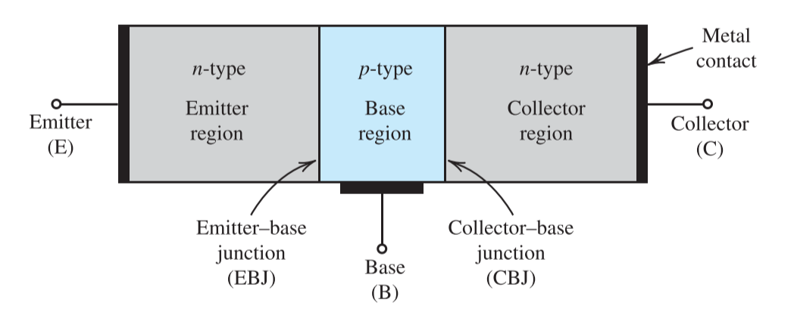
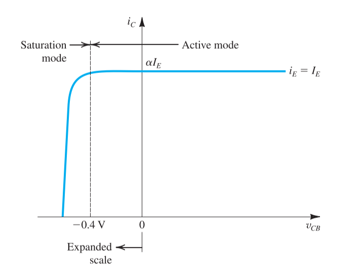
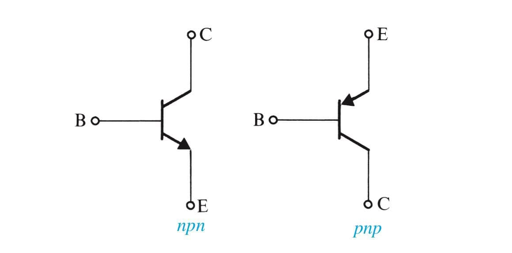
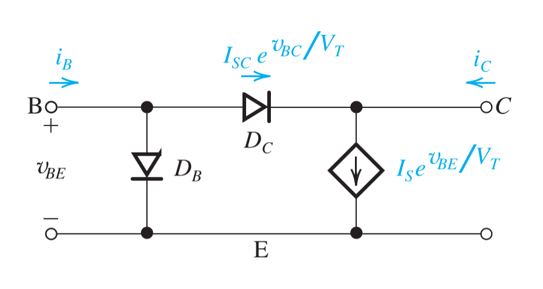

# Chapter 4 Bipolar Junction Transistors

## 4-1 Device Structure and Physical Operation

The BJT consists of three semiconductor regions: the **emitter(E)** region, the **base(B)** region and the **collector(C)** region

The transistor consists of two pn junctions, the **emitter-base junction** and **collector-base junction**. According to the different bias condition of each junction, there're three different working modes of transistors

|    Mode    |   EBJ   |   CBJ   |
| :--------: | :-----: | :-----: |
|   Cutoff   | Reverse | Reverse |
|   Active   | Forward | Reverse |
| Saturation | Forward | Forward |

### The npn Transistor

#### Operation in Active Mode

The current on the collector could be defined as

$$
i_C = I_Se^{v_{BE}/V_T}
$$

- $I_S$: saturation current
- $V_T$: the thermal voltage ($25\;mV$ at room temperature)

The base current consists of two basic parts: the injected holes to the emitter and the recombined electrons from the majority current

$$
i_B = \frac{i_C}{\beta} = \Big(\frac{I_S}{\beta}\Big)e^{v_{BE}/V_T}
$$

- $\beta$: transistor parameter (mostly in range 50 to 200)

The emitter current is the sum of the base current and the emitter current

$$
i_E = i_C+i_B = \frac{\beta+1}{\beta} i_C = \frac{\beta+1}{\beta} I_S e^{v_{BE}/V_T}
$$

If we define

$$
\alpha = \frac{\beta}{\beta+1}\qquad \beta = \frac{\alpha}{1-\alpha}
$$

Then the current of the collector could be expressed as

$$
i_C = \alpha i_E
$$

- $\alpha$: common-base current gain

#### Large-signal Model

The models above could be applied for any positive value of $v_{BE}$, and thus these models are referred to as **large-signal models**

#### Operation in Saturation Mode

$$
\begin{aligned}
    i_B &= (I_s/\beta)e^{v_{BE}/V_T}+I_{sc}e^{v_{BC}/V_T}\\[2ex]
    i_C &= I_se^{v_{BE}/V_T}-I_{sc}e^{v_{BC}/V_T}
\end{aligned}
$$

And the transistor parameter is defined as the ratio of the current on base to the collector

$$
\beta_{\text{forced}} = \frac{i_B}{i_C}\Bigg|_{\text{saturation}}\leq \beta
$$

And we also have the saturation voltage

$$
V_{CEsat} = V_{BE}-V_{BC}
$$

And the saturation voltage at the edge of saturation is $V_{CEsat} = 0.3\; V$, while a transistor deep in saturation has $V_{CEsat} = 0.2\; V$

### The pnp Transistor

#### Operation in Active Mode

It can be easily seen that the current-voltage relationship of the *pnp* transistor will be identical to that of the *npn* transistor except that $v_{BE}$ has to be replaced by $v_{EB}$

And the *pnp* transistor can operate in the saturation mode in a manner analogous to that described for the *npn* device

#### Large-signal Model

|             Model T             |           Model $\pi$            |
| :-----------------------------: | :------------------------------: |
|  |  |

## 4-2 Current-Voltage Characteristics

The polarity of the device *npn* or *pnp* is indicated by the direction of the **arrowhead on the emitter**, which points in the direction of normal current flow in the emitter, also the forward direction of the base-emitter junction.

According to the concepts mentioned in the first part, we could find the voltage characteristics of the both kinds of transistors

$$
\begin{aligned}
    i_C &= I_S e^{v_{BE}/V_T}\\[2ex]
    i_B &= \frac{i_C}{\beta} = \Big(\frac{I_S}{\beta}\Big)e^{v_{BE}/V_T}\\[2ex]
    i_E &= \frac{i_C}{\alpha} = \Big(\frac{I_S}{\alpha}\Big)e^{v_{BE}/V_T}\\[2ex]
\end{aligned}
$$

> $V_T = \frac{kT}{q}\approxeq 25\; mV$
> for *pnp* transistor, replace $v_{BE}$ with $v_{EB}$

$$
\begin{aligned}
    \beta &= \frac{\alpha}{1-\alpha}\\[2ex]
    \alpha &= \frac{\beta}{\beta+1}\\[2ex]
\end{aligned}
$$

## 4-3 BJT Circuits at DC

