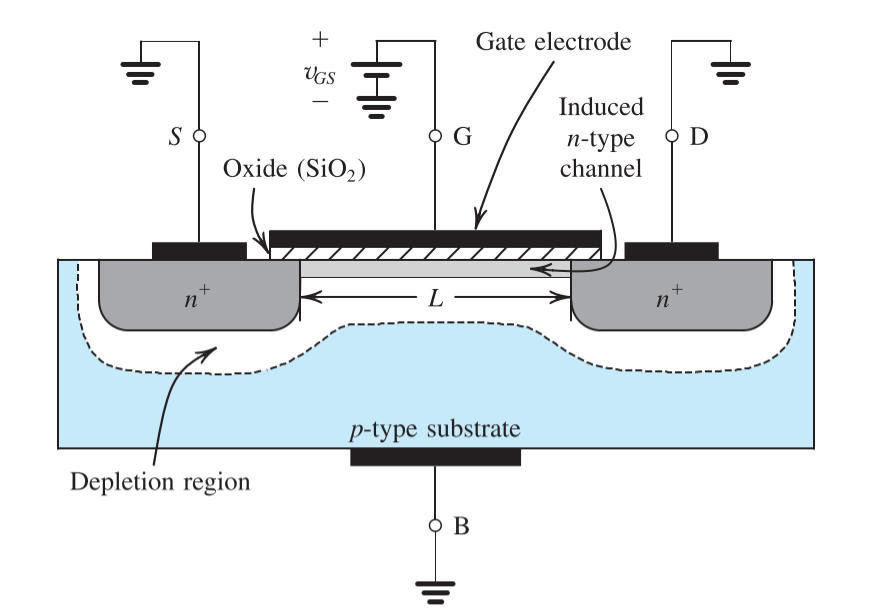
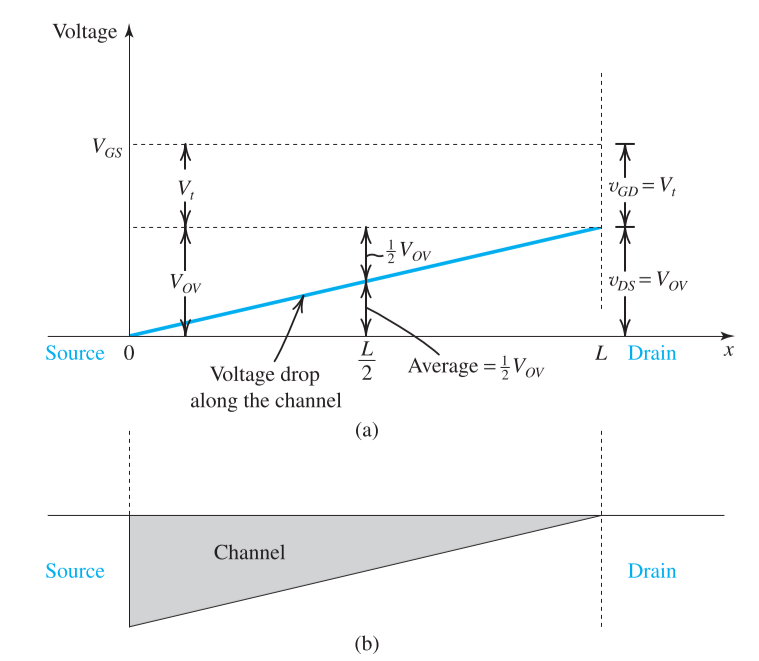
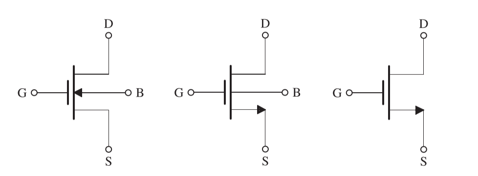
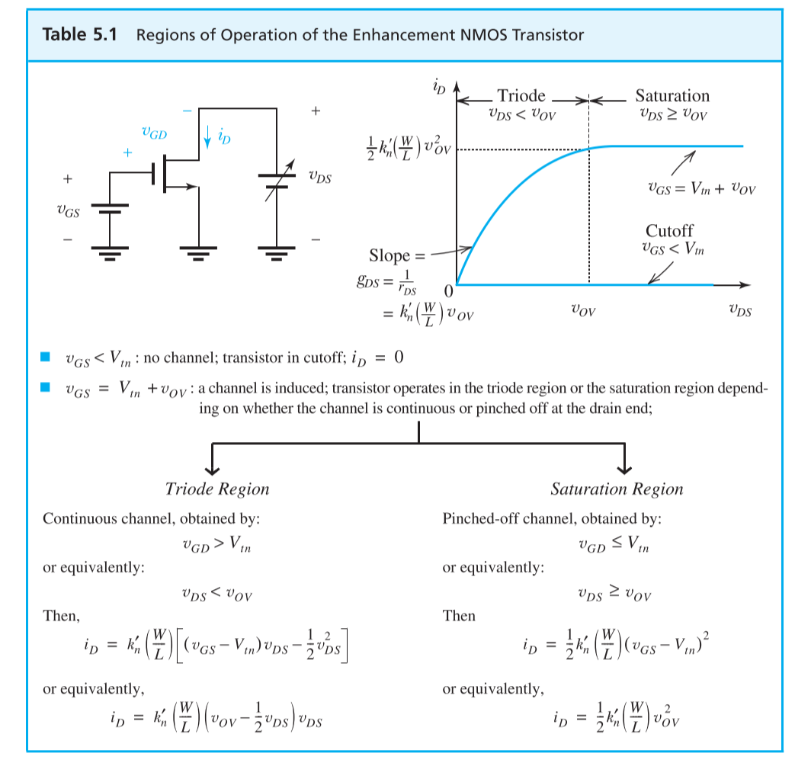

# Chapter 5 MOS Field-Effect Transistors

## 5-1 Device Structure and Physical Operation

### Device Structure

The figures above show the physical structure of the n-channel enhancement-type MOSFET

- two heavily doped n-type regions: **source** and **drain** regions 
- thin layer of silicon dioxide of thickness $t_{ox}$: covering area between source and drain regions
- metal is deposited on the top of oxide: form the **gate electrode** of the device
- metal is also deposited on source, drain and **body** regions

### Physical Operations

#### Zero Gate Voltage

With zero voltage applied to the  two back-to-back diodes exist in series between drain and source, which prevent the current conduction from source to drain as the voltage $v_{DS}$ is applied

#### Creating a Channel for Current Flow

Apply a positive voltage $v_{GS}$ between the **gate** to **source**

- free holes are **repelled** from the region of the substrate under the gate
- the positive voltage **attracted** electron from source and drain region to the channel region, which created an n-type channel
- the induced n region forms a **channel** for current flow

Since the flow have been established

- the gate and the channel region of the MOSFET form a parallel-plate capacitor, with the oxide layer acting as the capacitor dielectric
- the electric field thus develops in the vertical direction
- the field control the amount of charge in the channel also the conductivity

> **threshold voltage** $V_t$: to accumulate enough electrons to the channel, $v_{GS}$ must exceed threshold voltage
> **override voltage $V_{OV}$**: the excess of $v_{GS}$ over $V_t$ is termed as **effective voltage** $V_{OV} = v_{GS}-V_t$

The magnitude of the electron charge in the channel

$$
\|Q\| = C_{ox} (WL) v_{OV}
$$

- $C_{ox}$: **oxide capacitance**
    $$C_{ox} = \frac{\epsilon_{ox}}{t_{ox}}$$
    - $\epsilon_{ox}$: the permittivity of the silicon dioxide
    $$\epsilon_{ox}=3.9\epsilon_0 = 3.45\times 10^{-11}\;F/m$$
    - $t_{ox}$: oxide thickness

#### Applying a Small Voltage

Now apply a **small positive voltage** $v_{DS}$ between drain and source

The current on the drain region is 

$$
i_D = \Big[(\mu_nC_{ox})\big(\frac{W}{L}\big)v_{OV}\Big]v_{DS}
$$

- $\mu_n$: the mobility of the electrons
- $W/L$: aspect ratio

Since the other factor are determined in manufacturing, we could denote the factor as

- $k_n=\mu_nC_{ox}'$: the factor termed process transconductance parameter
- $k_n=k_n'(W/L)$: MOSFET transconductance parameter

#### Increase Voltage on Drain

As $v_{DS}$ is increased, the channel becomes more tapered and its resistance increases correspondingly. The relationship between $i_D$ and $v_{DS}$ could be derived according to the figure.

$$
\begin{aligned}
    i_D &= k_n'\big(\frac{W}{L}\big)(V_{OV}-\frac{1}{2}v_{DS})v_{DS}\\[2ex]
        &= k_n'\big(\frac{W}{L}\big)(V_{OV}v_{DS}-\frac{1}{2}v_{DS}^2)\\[2ex]
        &= k_n'(\frac{W}{L})\big[(v_{GS}-V_t)v_{DS}-\frac{1}{2}v_{DS}^2\big]
\end{aligned}
$$

#### Current Saturation

Increasing $v_{DS}$ over $V_{OV}$, the current through the channel remains constant at the value reaches for $v_{DS} = V_{OV}$. The drain current thus saturates.

$$
\begin{aligned}
    i_D &= \frac{1}{2}k_n'\Big(\frac{W}{L}\Big)v_{OV}^2\\[2ex]
        &= \frac{1}{2}k_n'\Big(\frac{W}{L}\Big)(v_{GS}-V_t)^2
\end{aligned}
$$

## 5-2 Current-Voltage Characteristic

### Circuit Symbol

 

The figure above show the circuit symbol for the n-channel MOSFET

 

The figure above show the circuit symbol for the p-channel MOSFET

### Current-Voltage Relationship on Drain

