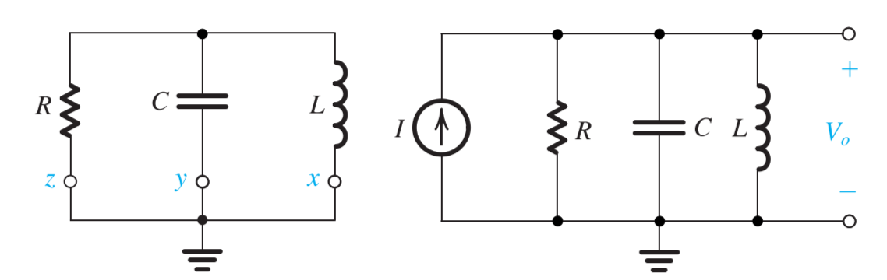
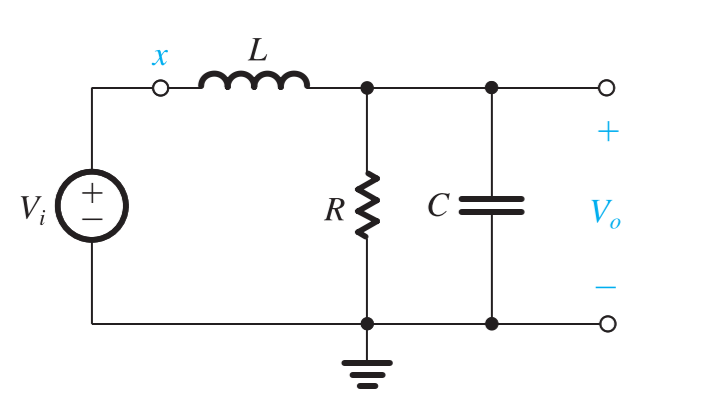
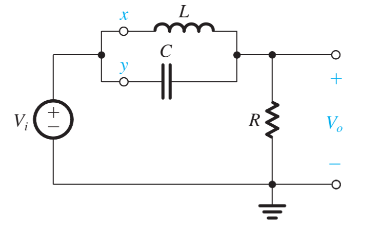
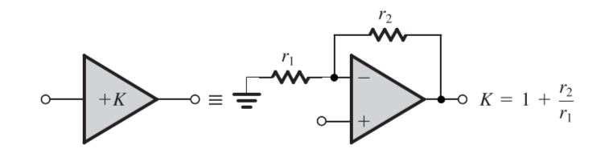
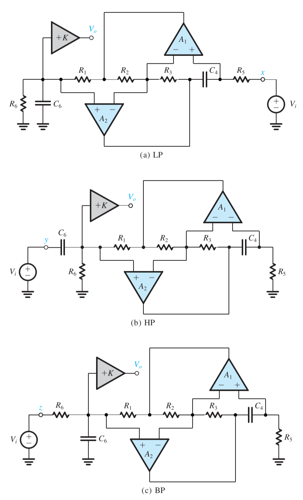

# Chapter 6 Filters

## 6-1 Filter Transmission, Types and Specification

### Filter Transmission

The filter transfer function $T(s)$ is the ratio of the output voltage $V_o(s)$ to the input voltage $V_i(s)$

$$
T(s) = \frac{V_o(s)}{V_i(s)}
$$

The filter **transmission** is evaluated by letting $s=j\omega$, then the transfer function could be expressed as

$$
T(j\omega) = \|T(j\omega)\|e^{j\phi(\omega)}
$$

The magnitude of the transfer function is termed as **gain function**

$$
G(j\omega) = 20\log{\|T(j\omega)\| }
$$

or expressed as the **attenuation function**

$$
A(j\omega) = -20\log{\|T(j\omega)\| }
$$

### Filter Types

### Filter Specification

- $\omega_p$: the passband edge
- $A_{max}$: the maximum allowed variation in passband transmission
- $\omega_s$: the stopband edge
- $A_{min}$: the minimum required stopband attenuation

## 6-2 Filter Transfer Function

The filter transfer function could be written as two polynomials as

$$
T(s) = \frac{a_ms^m+a_{m-1}s^{m-1}+\cdots+a_0}{s^n+b_{n-1}s^{n-1}+\cdots+b_0}
$$

- $N$: the filter order

Since the transfer functions have number zeros and poles, it could be rewritten into

$$
T(s) = \frac{a_m(s-z_1)(s-z_2)\cdots(s-z_m)}{(s-b_1)(s-b_2)\cdots)(s-b_n))}
$$

$$
T(s) = \frac{a_5s(s^2+\omega_{l1}^2)(s^2+\omega_{l2}^2)}{s^6+b_5s^5+\cdots+a_0}
$$

## 6-3 Butterworth and Chebyshev Filter

### Butterworth Filter

The figure above shows a sketch of Butterworth filter and the **magnitude function** for an N-th Butterworth filter with a bandpass edge $\omega_p$ is given as

$$
\|T(j\omega)\| = \frac{1}{\sqrt{1+\epsilon^2\big(\frac{\omega}{\omega_p}\big)^2}}
$$

At the frequency of $\omega_p$

$$
\|T(j\omega)\| = \frac{1}{\sqrt{1+\epsilon^2}}
$$

Then the parameter $\epsilon$ determines $A_{max}$

$$
\begin{aligned}
    A_{max} &= 10\log{(1+\epsilon^2)}\\[2ex]
    \epsilon &= \sqrt{10^{A_{max}/10}-1}
\end{aligned}
$$

At the edge of stopband $\omega=\omega_s$, check the attenuation of the filter

$$
A(\omega_s) = 10\log{\Big[1+\epsilon^2(\omega_s/\omega_p)^{2N}\Big]}
$$

Find the lowest filter order $N$ such that $A(\omega_s)>A_{min}$

Then the transfer function could be written as

$$
T(s) = \frac{K\omega_0^N}{(s-p_1)(s-p_2)\cdots(s-p_N)}
$$

- $\omega_0=\omega_p(1/\epsilon)^{1/N}$

### Chebyshev Filter

The figure above shows a sketch of Chebyshev filter and the **magnitude function** for an N-th Chebyshev filter with a bandpass edge $\omega_p$ is given as

$$
\|T(j\omega)\| =
\begin{cases}
 \frac{1}{\sqrt{1+\epsilon^2\cos^2[N\cos^{-1}(\omega/\omega_p)]}} \qquad \omega <\omega_p\\[2ex]
 \frac{1}{\sqrt{1+\epsilon^2\cosh^2[N\cosh^{-1}(\omega/\omega_p)]}} \qquad \omega >\omega_p
\end{cases}
$$

At the frequency of $\omega_p$

$$
\|T(j\omega)\| = \frac{1}{\sqrt{1+\epsilon^2}}
$$

Then the parameter $\epsilon$ determines $A_{max}$

$$
\begin{aligned}
    A_{max} &= 20\log{\sqrt{1+\epsilon^2}}\\[2ex]
    \epsilon &= \sqrt{10^{A_{max}/10}-1}
\end{aligned}
$$

At the edge of stopband $\omega=\omega_s$, check the attenuation of the filter

$$
A(\omega_s) = 10\log{\Big[1+\epsilon^2\cosh^2(N\cosh^{-1}(\omega_s/\omega_p))\Big]}
$$

Find the lowest filter order $N$ such that $A(\omega_s)>A_{min}$

And the poles of the Chebyshev filter are given by

$$
\begin{aligned}
    p_k = &-\omega_p\sin\Big(\frac{2k-1}{N}\frac{\pi}{2}\Big)\sinh\Big(\frac{1}{N}\sinh^{-1}\frac{1}{\epsilon}\Big)\\[2ex]
     &+j\omega_p\cos\Big(\frac{2k-1}{N}\frac{\pi}{2}\Big)\cosh\Big(\frac{1}{N}\sinh^{-1}\frac{1}{\epsilon}\Big)\qquad k = 1,2,\cdots,N
\end{aligned}
$$

Then the transfer function could be written as

$$
T(s) = \frac{K\omega_p^N}{\epsilon 2^{N-1}(s-p_1)(s-p_2)\cdots(s-p_N)}
$$

- $\omega_0=\omega_p(1/\epsilon)^{1/N}$

## 6-4 First-Order and Second-Order Filter Functions

### First Order Filters

The general first-order transfer function is given by

$$
T(s) = \frac{a_1s+a_0}{s+\omega_0}
$$

### Second Order Filters

The general second-order transfer function is given by

$$
T(s) = \frac{a_2s^2+a_1s+a_0}{s^2+(\omega_0/Q)s+\omega_0^2}
$$

where $\omega_0$ and $Q$ determines the natural poles

$$
p_{1,2} = -\frac{\omega_0}{2Q}\pm j\omega_0\sqrt{1-(1/4Q^2)}
$$

## 6-5 Second-Order LCR Resonator

### Resonator Natural Mode

$$
\begin{aligned}
    \frac{V_o}{I} &= \frac{1}{Y} = \frac{1}{(1/sL)+sC+(1/R)}\\[2ex]
                  &= \frac{s/C}{s^2+s(1/CR)+(1/LC)} = \frac{}{s^2+s(\omega_0/Q)+\omega_0^2}
\end{aligned}
$$

Where we could get that

$$
\begin{aligned}
    \omega_0 &= \frac{1}{\sqrt{LC}}\\[2ex]
    Q &= \omega_0 CR
\end{aligned}
$$

### Realization of the Various Filter Types

#### Low-Pass Function

$$
T(s) = \frac{Z_2}{Z_1+Z_2} = \frac{\omega_0^2}{s^2+s(\omega_0/Q)+\omega_0^2}
$$

> 2nd-order low-pass filters have **2 zeros** at $\infty$

#### High-Pass Function

$$
T(s) = \frac{Z_2}{Z_1+Z_2} = \frac{s^2}{s^2+s(\omega_0/Q)+\omega_0^2}
$$

> 2nd-order high-pass filters have **2 zeros** at $s=0$

#### Band-Pass Function

$$
T(s) = \frac{Z_2}{Z_1+Z_2} = \frac{(\omega_0/Q)s}{s^2+s(\omega_0/Q)+\omega_0^2}
$$

> 2nd-order band-pass filters have **1 zero** at $\infty$ and **1 zero** at $s=0$

#### Notch Function

$$
T(s) = \frac{Z_2}{Z_1+Z_2} = a_2\frac{s^2+\omega_0^2}{s^2+s(\omega_0/Q)+\omega_0^2}
$$

> 2nd-order notch(bandstop) filters have **2 zeros** at $j\omega$ axis

## 6-6 Second-Order Active Filters Based on Inductor Replacement

### Antoniou Inductance-Simulation Circuit

If the circuit is fed at its input (node 1) with a voltage source $V_1$ and the input current is denoted $I_1$, then for the ideal op amp the input impedance is

$$
Z_{in} = \frac{V_1}{I_1} = s\frac{C_4R_1R_3R_5}{R_2}
$$

which gives the inductance

$$
L = \frac{C_4R_1R_3R_5}{R_2}
$$

The design of the circuit is usually selecting $R_1=R_2=R_3=R_5=R$ and $C_4=C$, which leads to $L = CR^2$

### Op Amp-RC Resonator

The circuit is a second-resonator having a pole frequency

$$
\omega_0 = 1/\sqrt{LC_6}=\sqrt{R_2/C_4C_6R_1R_3R_5}
$$

And the quality factor of

$$
Q = \omega_0 C_6 R_6 = R_6 \sqrt{\frac{C_6}{C_4}\frac{R_2}{R_1R_3R_5}}
$$

By selecting $C_4=C_6=C$ and $R_1=R_2=R_3=R_5=R$

$$
\begin{aligned}
    \omega_0 &= 1/CR\\[2ex]
    Q &= R_6/R
\end{aligned}
$$

### Realization of the Various Filter Types

## 6-7 Second-Order Active Filters Based on the Two-Integrator-Loop Topology

### Derivation of the Two-Integrator-Loop Biquad

Consider the second-order high-pass transfer function

$$
\frac{V_{hp}}{V_i} = \frac{Ks^2}{s^2+s(\omega_0/Q)+\omega_0^2}
$$

Dividing both sides with $s^2$

$$
V_{hp}+\frac{1}{Q}\frac{\omega_0}{s}V_{hp}+\frac{\omega_0^2}{s^2}V_{hp}=KV_i
$$

Reexpressing $V_{hp}$ in terms of its single- and double-integrated versions and $V_i$

$$
V_{hp}=KV_i-\frac{1}{Q}\frac{\omega_0}{s}V_{hp}-\frac{\omega_0^2}{s^2}V_{hp}
$$

### Circuit Implementation (KHN Biquad)

$$
\begin{aligned}
    V_{hp} &= V_i \frac{R_3}{R_2+R_3}\Big(1+\frac{R_f}{R_1}\Big)+V_{bp}\frac{R_2}{R_2+R3}\Big(1+\frac{R_f}{R_1}\Big)-V_{lp}\frac{R_f}{R_1}\\[2ex]
           &= V_i \frac{R_3}{R_2+R_3}\Big(1+\frac{R_f}{R_1}\Big)+\Big(-\frac{\omega_0}{s}V_{hp}\Big)\frac{R_2}{R_2+R3}\Big(1+\frac{R_f}{R_1}\Big)-\Big(\frac{\omega_0^2}{s^2}V_{hp}\Big)\frac{R_f}{R_1}\\[2ex]
\end{aligned}
$$

- $CR=1/\omega_0$
- $R_f=R_1$
- $R_3/R_2=2Q-1$
- $K=2-(1/Q)$

$$
\begin{aligned}
    V_o &= -(\frac{R_F}{R_H}V_{hp}+\frac{R_F}{R_B}V_{bp}+\frac{R_F}{R_L}V_{lp})\\[2ex]
        &= -V_i(\frac{R_F}{R_H}T_{hp}+\frac{R_F}{R_B}T_{bp}+\frac{R_F}{R_L}T_{lp})\\[2ex]
    \frac{V_o}{V_i} &= -K\frac{(R_F/R_H)s^2-s(R_F/R_B)\omega_0+(R_F/R_L)\omega_0^2}{s^2+s(\omega_0/Q)+\omega_0^2}
\end{aligned}
$$

### An Alternative Implementation (Tow–Thomas Biquad)

$$
\frac{V_o}{V_i} = -\frac{s^2\big(\frac{C_1}{C}\big)+s\frac{1}{C}\big(\frac{1}{R_1}-\frac{r}{RR_3}\big)+\frac{1}{C^2RR_2}}{s^2+s\frac{1}{QCR}+\frac{1}{C^2R^2}}
$$

- $r=\text{arbitrary}$
- $C=\text{arbitrary}$
- $R=1/\omega_0$

