[TOC]

# Chapter 1 Introduction

## 1-1 Signal Amplification

$$
\begin{aligned}
    v_o(t) = C\cdot v_i(t) 
\end{aligned}
$$

- $v_i(t)$: input signal
- $v_o(t)$: output signal
- $A$: **amplifier gain**

### Case 1: Signal Transmission

A small signal need to be transmitted from a sender to a receiver through a wired channel

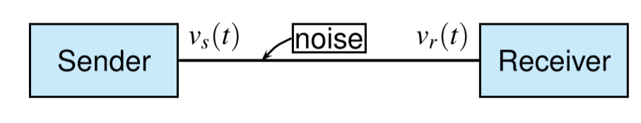

It could be hard to be finished because the transmitting channels are noisy. Let $v_n(t)$ denote the noise voltage, then $v_r(t)=v_s(t)+v_n(t)$

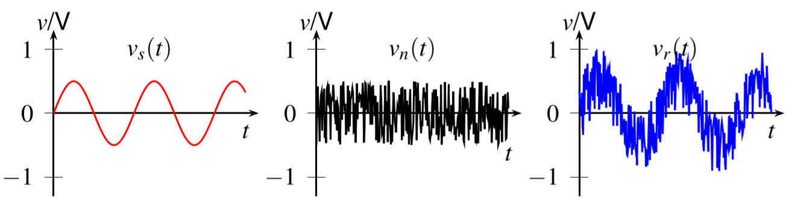

If the signal is amplified before transmission

Then it could be easier to identify the receive voltage

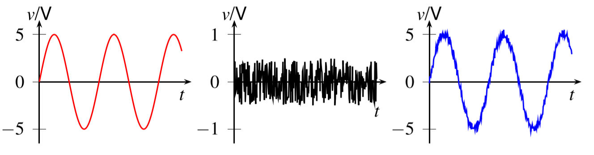

### Case 2: Digital Mobile Phone

The signal processing subsystem in a digital mobile phone

- LNA: low noise amplifier
- A/D: analog to digital converter

Since the signal received by antenna is too weak, which is usually in $\mu V$ range, while the A/D converter required the input signal with the range from 0 to 3.3 V.

The processing could be much easier if the signal magnitude is larger.

## 1-2 Amplifiers

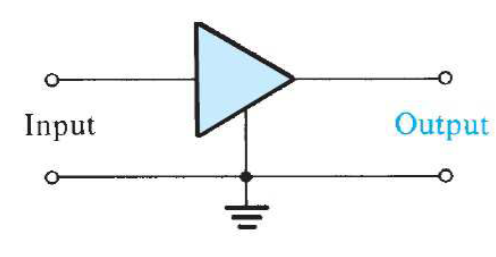

The signal amplifier is a two-port network and only **dependent sources** could be used to realize amplifiers

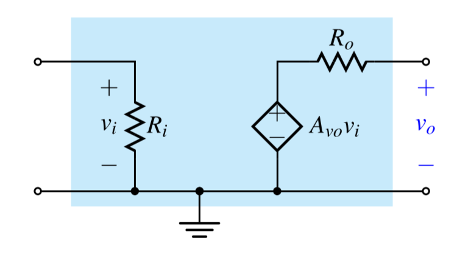

- $R_i$: input resistance
- $R_o$: output resistance
- $A_{vo}$: **open-circuit** voltage gain

### Different Amplifiers

|            Type            |                    Circuit Model                    |       Gain Parameter       |    Ideal Characteristics     |
| :------------------------: | :-------------------------------------------------: | :------------------------: | :--------------------------: |
|     Voltage Amplifier      |      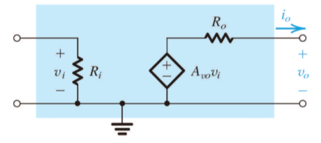      | $A_{vo} = \frac{v_o}{v_i}$ |   $R_i = \infty, R_o = 0$    |
|     Current Amplifier      |     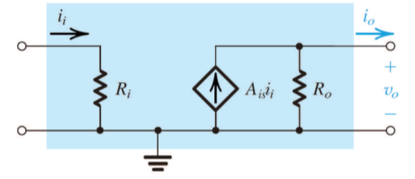      | $A_{is} = \frac{i_o}{i_i}$ |   $R_i = 0, R_o = \infty$    |
| Transconductance Amplifier | 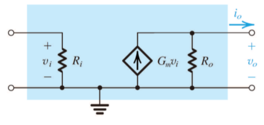 |  $G_m = \frac{i_o}{v_i}$   | $R_i = \infty, R_o = \infty$ |
| Transresistance Amplifier  |   |  $R_m = \frac{v_o}{i_i}$   |      $R_i = 0, R_o = 0$      |

### Amplifier Power Efficiency

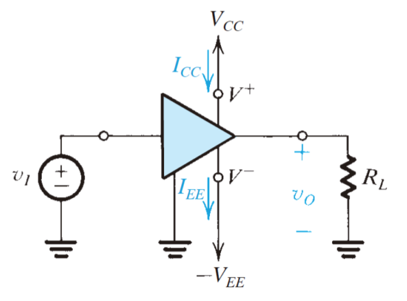

The DC power delivered to the amplifier is

$$
P_{dc} = V_{CC}I_{CC}+V_{EE}I_{EE}
$$

The power-balance equation over the circuit is

$$
P_{dc} +P_I = P_L+P_{\text{dissipated}}
$$

The amplifier power efficiency is

$$
\eta = \frac{P_L}{P_{dc}}\times 100\%
$$

### Characters of Amplifiers

There are several important parameter of amplifiers:

- $A$: Gain
- $R_i$: Input Resistance
- $R_o$: Output Resistance

#### Amplifier Gain

A voltage amplifier fed with a signal $v_i(t)$ and connected to a load resistance $R_L$

- Voltage Gain: $A_v=\frac{v_o}{v_i}$
- Current Gain: $A_i=\frac{i_o}{i_i}$
- Power Gain: $A_p=\frac{v_o i_o}{v_i i_i}$

And there is relationship between power gain, voltage gain and current gain is

$$
A_p = A_oA_i
$$

And electronics engineers prefer to express amplifier gain with **logarithmic measure**

- Voltage Gain in decibels: $20\log\|A_v\|\;dB$
- Current Gain in decibels: $20\log\|A_i\|\;dB$
- Power Gain in decibels: $10\log\|A_p\|\;dB$

#### Input and Output Resistance

The input resistance $R_i$ is **an equivalent resistance** that accounts for the fact that the amplifier draws an input current from the signal source

$$
v_i = v_s \frac{R_i}{R_i+R_s}
$$

A **voltage amplifier** with ***larger input resistance*** draw less current from the signal source, and its $v_i$ is closer to $v_s$

$$
v_o = A_{vo}v_i \frac{R_L}{R_L+R_o}
$$

A **voltage amplifier** with ***smaller output resistance*** has stronger ability to drive a heavy load

#### Determine Input and Output Resistance

- Determine $R_i$: by applying an **input voltage** $v_i$ and calculating the **input current** $i_i$
  
$$
R_i = \frac{v_i}{i_i}
$$

- Determine $R_o$: by finding ratio of the **open-circuit output voltage** to the **short-circuit output current**

### Overall Gain

- Voltage Gain
$$
A_v = \frac{v_o}{v_i} = A_{vo}\cdot \frac{R_L}{R_L+R_o}
$$
- Overall Gain
$$
\frac{v_o}{v_s} = A_{vo}\cdot\frac{R_i}{R_i+R_s}\frac{R_L}{R_L+R_o}
$$

### Characterizing Amplifiers

A perfect **voltage amplifier** should have

- large input resistance
- small output resistance
- a gain that is controllable ina wide range

# Chapter 2 Op Amp

## 2-1 Ideal Op Amp

### Models of Ideal Op Amp

From a signal point of view the op amp has three terminals: two inputs and one output terminal

|  Pin  |    Terminal    |
| :---: | :------------: |
|   1   | Negative Input |
|   2   | Positive Input |
|   3   |     Output     |

Most IC op amp have 5 terminals: two inputs, one output and two DC power terminals

|  Pin  |    Terminal    |
| :---: | :------------: |
|   1   | Negative Input |
|   2   | Positive Input |
|   3   |     Output     |
|   4   | Positive Power |
|   5   | Negative Power |

### Function and Characteristics of the Ideal Op Amp

- Infinite input impedance
- Zero output impedance
- Zero [common-mode gain](#differential-and-common-mode-signals)
- Infinite open-loop gain A
- Infinite bandwidth

### Differential and Common-Mode Signals

The differential input signal $v_{Id}$ is simply the difference between the two input signals $v_1$ and $v_2$

$$
v_{Id} = v_2-v_1
$$

The common-mode input signal $v_{Icm}$ is the average of the two input signals $v_1$ and $v_2$

$$
v_{Icm} = \frac{1}{2}(v_1+v_2)
$$

Made the equation express $v_1$ and $v_2$ as

$$
\begin{cases}
    v_1 = v_{Icm}-v_{Id}/2\\[2ex]
    v_2 = v_{Icm}+v_{Id}/2
\end{cases}
$$

which could turn the input terminals into another presentation

### Analysis Method

There are tree rules to analyze the op amp circuit

- ==**virtual short**==: $v_+=v_-$
- ==**virtual open**==: $i_+=0,i_-=0$
- ==**zero output resistance**==: $R_O=0$

## 2-2 Inverting Amplifier

The **closed-loop gain** G could be determined as

$$
G = \frac{v_O}{v_I}
$$

Since $v_-=v_+=0$

$$
i_1 = \frac{v_I-0}{R_1}=\frac{v_I}{R_1}\quad i_2 = \frac{0-v_O}{R_2} = -\frac{v_O}{R_2}
$$

And we have $i_1=i_2$

$$
\begin{aligned}
    \frac{v_I}{R_1} &= - \frac{v_O}{R_2}\\[2ex]
    \frac{v_O}{v_I} &= -\frac{R_2}{R_1}
\end{aligned}
$$

- gain: $R_2/R_1$
- input resistance: $R_1$
- output resistance: $R_O = 0$

### T-shape Feedback Network

Since $v_-=v_+=0$

$$
i_1 = \frac{v_I-0}{R_1} = \frac{v_I}{R_1}
$$

And we have $i_1=i_2$

$$
v_x = -i_2R_2 = -i_1 R_2 = -\frac{R_2}{R_1}v_I
$$

Therefore $i_3$ could be determined as

$$
i_3 = \frac{v_x}{R_3} = -\frac{R_2}{R_1}\cdot\frac{v_I}{R_3}
$$

The output voltage could be calculated 

$$
\begin{aligned}
    v_o &= v_x+i_4R_4\\[2ex] 
        &= -\frac{R_2}{R_1}v_I-(i_2+i_3)R_4\\[2ex]
        &= -\frac{R_2}{R_1}v_I-(i_1+i_3)R_4\\[2ex]
        &= -\frac{R_2}{R_1}v_I-(\frac{1}{R_1}+\frac{R_2}{R_1}\cdot\frac{1}{R_3})v_I R_4\\[2ex]
        &= -(\frac{R_2}{R_1}+\frac{R_4}{R_1}+\frac{R_2}{R_1}\frac{R_4}{R_3})v_I\\[2ex]
\end{aligned}
$$

## 2-3 Noninverting Amplifier

The **closed-loop gain** G could be determined as

$$
G = \frac{v_O}{v_I}
$$

Since $v_-=v_+=v_1$

$$
i_1 = \frac{v_I-0}{R_1}=\frac{v_I}{R_1}\quad i_2 = \frac{v_O-v_I}{R_2}
$$

And we have $i_1=i_2$

$$
\begin{aligned}
    \frac{v_I}{R_1} &= \frac{v_O-v_I}{R_2}\\[2ex]
    (R_1+R_2)v_I &= R_1 v_O\\[2ex]
    \frac{v_O}{v_I} &=(1+\frac{R_2}{R_1})
\end{aligned}
$$

- gain: $1+\frac{R_2}{R_1}$
- input resistance: $R_I = \infty$
- output resistance: $R_O = 0$

## 2-4 Difference Amplifier

A difference amplifier is one that responds to the difference between the two signals applied at its input and ideally rejects signals that are common to the two inputs.

Take the following two amplifiers into consideration

$$
v_{O1} = -\frac{R_2}{R_1}v_{I1}\qquad v_{O2} = (1+\frac{R_2}{R_1})\frac{R_4}{R_3+R_4}v_{I2}
$$

To produce no response to the common part, which means $v_{I1} = v_{I2}$

$$
\begin{aligned}
    v_{O1}+v_{O2} &= 0\\[1ex]
    \frac{R_2}{R_1}v_{I1} &= (1+\frac{R_2}{R_1})\frac{R_4}{R_3+R_4}v_{I2}\\[2ex]
    \frac{R_2}{R_1}\cdot \frac{R_1}{R_1+R_2} &= \frac{R_4}{R_3+R_4}\\[3ex]
    \frac{R_4}{R_2} &= \frac{R_3}{R_1}
\end{aligned}
$$

Now the common difference amplifier could be analyzed in the same way

The voltage on the input terminals could be determined as

$$
\frac{R_4}{R_3+R_4}v_{Icm}
$$

The current on $R_1$ is

$$
i_1 = \frac{R_3}{R_1} \frac{1}{R_3+R_4}v_{Icm}
$$

And we know $i_1=i_2$

$$
\begin{aligned}
    v_O &= \frac{R_4}{R_3+R_4}v_{Icm}-\frac{R_3}{R_1}\frac{R_2}{R_3+R_4}v_{Icm}\\[2ex]
    &= \frac{v_{Icm}}{R_3+R_4}(R_4-\frac{R_3}{R_1}R_2)\\[2ex]
    \frac{v_O}{v_{Icm}} &= \frac{R_4}{R_3+R_4}(1-\frac{R_2}{R_1}\frac{R_3}{R_4}) = 0
\end{aligned}
$$

Since we've chosen the resistor ratio, the gain for the common-mode is 0

But any mismatch in the resistance ratio could cause $A_{cm}$ nonzero, hence, high input resistance is required for a difference amplifier, which is called **differential input resistance** $R_{id}$

We assume that 

$$
R_3 = R_1\qquad R_4 = R_2
$$

And the definition of the **differential input resistance** is

$$
R_{Id} = \frac{v_{Id}}{i_I}
$$

Since the two terminals shares the same voltage, the loop seems to be a short circuit.

$$
v_{Id} = i_IR_1+0+i_IR_1
$$

Thus

$$
R_{Id} = 2R_1
$$

## 2-5 DC Imperfections

### Offset Voltage

If the two input terminals of the op amp are tied together and connected to ground, it will be found that despite the fact thar $v_{Id}=0$, a finite dc voltage exists at the output.

The op-amp output can be brought back to its ideal value of $0\;V$ by connecting a dc voltage source of appropriate polarity and magnitude between the two input terminals of the op amp.

It follows that the **input offset voltage** $V_{OS}$ must be of equal magnitude and of opposite polarity of the voltage

Based on the principle of superposition, we can find the both the inverting and the noninverting amplifier configurations result in the same circuit

The output voltage due to $V_{OS}$ is found to be 

$$
V_O =V_{OS}\Big[1+\frac{R_2}{R_1}\Big]
$$

### Input Bias and Offset Currents

In order for the op amp to operate, its two input terminals have to be supplied with dc currents, termed the **input bias currents**, which are independent og the fact that a real op amp has finite input resistance

The average value $I_B$ is called the **input bias current**

$$
I_B = \frac{I_{B1}+I_{B2}}{2}
$$

and the difference is called the **input offset current** and is given by

$$
I_{OS} = |I_{B1}-I_{B2}|
$$

> Typical values for general-purpose op amps are $I_B = 100 \;nA$ and $I_{OS}=10\; nA$

Now we can analyses the closed loop amplifier, taking into account the input bias currents

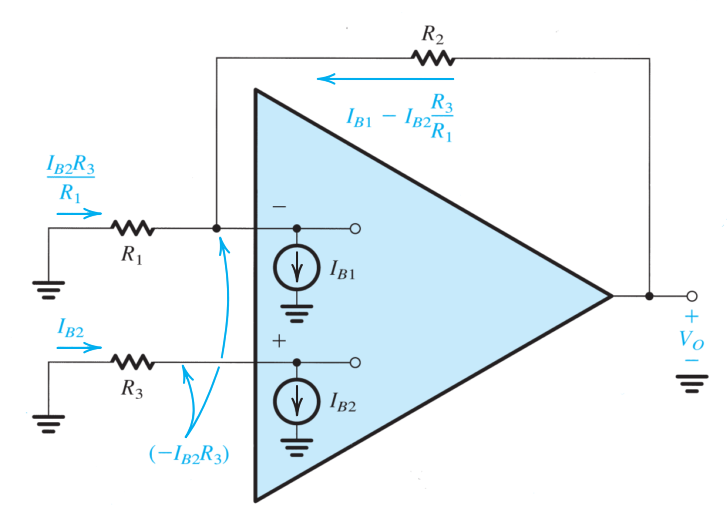

$$
V_O = -I_{B2}R_3+R_2(I_{B1}-\frac{R_3}{R_1}I_{B2})
$$

Consider the case $I_{B1}=I_{B2}=I_B$, which results in

$$
V_O = I_B[R_2-R_3(1+R_2/R_1)]
$$

Thus output voltage could be zero when selecting $R_3$ equal to

$$
R_3 = \frac{R_2}{1+R_2/R_1}=\frac{R_1R_2}{R_1+R_2}
$$

But in an **ac-coupled** amplifier the dc resistance seen by the inverting terminal is $R_2$, then $R_3$ is chosen equal to $R_2$

### Effect of Finite Open-loop Gain

Since the op-amp open-loop gain A is finite

$$
v_+-v_- = \frac{v_O}{A}\Rightarrow v_-=-\frac{v_O}{A}
$$

thus

$$
i_1 = \frac{v_{I}-(-v_O/A)}{R_1}=\frac{v_I+v_O/A}{R_1}
$$

Then the output voltage $v_O$ becomes

$$
v_O = -\frac{v_O}{A}-i_1R_2=-\frac{v_O}{A}-\Big(\frac{v_I+v_O/A}{R_1}\Big)R_2
$$

where the the closed-loop gain is found as

$$
G= \frac{v_O}{v_I} = -\frac{R_2/R_1}{1+(1+R_2/R_1)/A}
$$

Similarly, we could get the closed-loop gain for the noninverting amplifier

$$
G= \frac{v_O}{v_I} = \frac{1+(R_2/R_1)}{1+(1+R_2/R_1)/A}
$$

# Chapter 3 Diode

## 3-1 Ideal Diode

The **ideal diode** may be considered to be the most fundamental ==nonlinear== circuit element, which has two nodes:

- **anode**: the positive terminal
- **cathode**: the negative terminal

If a negative voltage is applied

- no current flows
- reverse biased
- **cut off**

If a positive current is applied

- zero voltage drop
- forward biased
- **turn on**

### A simple Application: The Rectifier

### Another Application: Diode Logic Gates

For the figure (a), the circuit implements with the **logic OR function**

$$
Y = A+B+C
$$

For the figure (b), the circuit implements with the **logic AND function**

$$
Y = A\cdot B\cdot C
$$

### The Constant-Voltage-Drop Model

The simplest and most widely used diode model is the constant-voltage-drop model. This model is based on the observation that a forward-conducting diode has a voltage drop that varies in a relatively narrow range from 0.6 to 0.8 volt. The model assumes **this voltage to be constant at a value of 0.7 volt**

## 3-2 Special Diode Types

### LED

The light-emitting diode converts a forward current into light and the current on the diode could be determined by

$$
i_D = \frac{V_{CC}-V_D}{R}
$$

> typical current ratings ranges from around 1 mA to 20 mA depending on the size of a LED

### Zener Diodes

A Zener diode is a special type of diode designed to reliably allow current to flow "backwards" when a certain set reverse voltage, where it is be equivalently expressed as 

$$
V_Z = V_{Z0} +r_ZI_Z
$$

## 3-3 Rectifier and Limiting Circuits

### The Half-Wave Rectifier

$$
PIV = V_S
$$

> **peak inverse voltage (PIV)**: the voltage that the diode must be able to withstand without breakdown

### The Full-Wave Rectifier

$$
PIV = 2V_S-V_D
$$

### The Bridge Rectifier

$$
PIV = V_S-2V_D+V_D = V_S-V_D
$$

### The Peak Rectifier

### Precision Half-Wave Rectifier

### Limiter Circuits

### Clamped Capacitor

### Voltage Doubler

# Chapter 4 Bipolar Junction Transistors

## 4-1 Device Structure and Physical Operation

The BJT consists of three semiconductor regions: the **emitter(E)** region, the **base(B)** region and the **collector(C)** region

The transistor consists of two pn junctions, the **emitter-base junction** and **collector-base junction**. According to the different bias condition of each junction, there're three different working modes of transistors

|    Mode    |   EBJ   |   CBJ   |
| :--------: | :-----: | :-----: |
|   Cutoff   | Reverse | Reverse |
|   Active   | Forward | Reverse |
| Saturation | Forward | Forward |

### The npn Transistor

#### Operation in Active Mode

The current on the collector could be defined as

$$
i_C = I_Se^{v_{BE}/V_T}
$$

- $I_S$: saturation current
- $V_T$: the thermal voltage ($25\;mV$ at room temperature)

The base current consists of two basic parts: the injected holes to the emitter and the recombined electrons from the majority current

$$
i_B = \frac{i_C}{\beta} = \Big(\frac{I_S}{\beta}\Big)e^{v_{BE}/V_T}
$$

- $\beta$: transistor parameter (mostly in range 50 to 200)

The emitter current is the sum of the base current and the emitter current

$$
i_E = i_C+i_B = \frac{\beta+1}{\beta} i_C = \frac{\beta+1}{\beta} I_S e^{v_{BE}/V_T}
$$

If we define

$$
\alpha = \frac{\beta}{\beta+1}\qquad \beta = \frac{\alpha}{1-\alpha}
$$

Then the current of the collector could be expressed as

$$
i_C = \alpha i_E
$$

- $\alpha$: common-base current gain

#### Large-signal Model

The models above could be applied for any positive value of $v_{BE}$, and thus these models are referred to as **large-signal models**

#### Operation in Saturation Mode

$$
\begin{aligned}
    i_B &= (I_s/\beta)e^{v_{BE}/V_T}+I_{sc}e^{v_{BC}/V_T}\\[2ex]
    i_C &= I_se^{v_{BE}/V_T}-I_{sc}e^{v_{BC}/V_T}
\end{aligned}
$$

And the transistor parameter is defined as the ratio of the current on base to the collector

$$
\beta_{\text{forced}} = \frac{i_B}{i_C}\Bigg|_{\text{saturation}}\leq \beta
$$

And we also have the saturation voltage

$$
V_{CEsat} = V_{BE}-V_{BC}
$$

And the saturation voltage at the edge of saturation is $V_{CEsat} = 0.3\; V$, while a transistor deep in saturation has $V_{CEsat} = 0.2\; V$

### The pnp Transistor

#### Operation in Active Mode

It can be easily seen that the current-voltage relationship of the *pnp* transistor will be identical to that of the *npn* transistor except that $v_{BE}$ has to be replaced by $v_{EB}$

And the *pnp* transistor can operate in the saturation mode in a manner analogous to that described for the *npn* device

#### Large-signal Model

## 4-2 Current-Voltage Characteristics

The polarity of the device *npn* or *pnp* is indicated by the direction of the **arrowhead on the emitter**, which points in the direction of normal current flow in the emitter, also the forward direction of the base-emitter junction.

According to the concepts mentioned in the first part, we could find the voltage characteristics of the both kinds of transistors

$$
\begin{aligned}
    i_C &= I_S e^{v_{BE}/V_T}\\[2ex]
    i_B &= \frac{i_C}{\beta} = \Big(\frac{I_S}{\beta}\Big)e^{v_{BE}/V_T}\\[2ex]
    i_E &= \frac{i_C}{\alpha} = \Big(\frac{I_S}{\alpha}\Big)e^{v_{BE}/V_T}\\[2ex]
\end{aligned}
$$

> $V_T = \frac{kT}{q}\approxeq 25\; mV$
> for *pnp* transistor, replace $v_{BE}$ with $v_{EB}$

$$
\begin{aligned}
    \beta &= \frac{\alpha}{1-\alpha}\\[2ex]
    \alpha &= \frac{\beta}{\beta+1}\\[2ex]
\end{aligned}
$$

## 4-3 BJT Circuits at DC

## 4-4 Small Signal Analysis

# Chapter 5 MOS Field-Effect Transistors

## 5-1 Device Structure and Physical Operation

### Device Structure

The figures above show the physical structure of the n-channel enhancement-type MOSFET

- two heavily doped n-type regions: **source** and **drain** regions 
- thin layer of silicon dioxide of thickness $t_{ox}$: covering area between source and drain regions
- metal is deposited on the top of oxide: form the **gate electrode** of the device
- metal is also deposited on source, drain and **body** regions

### Physical Operations

#### Zero Gate Voltage

With zero voltage applied to the  two back-to-back diodes exist in series between drain and source, which prevent the current conduction from source to drain as the voltage $v_{DS}$ is applied

#### Creating a Channel for Current Flow

Apply a positive voltage $v_{GS}$ between the **gate** to **source**

- free holes are **repelled** from the region of the substrate under the gate
- the positive voltage **attracted** electron from source and drain region to the channel region, which created an n-type channel
- the induced n region forms a **channel** for current flow

Since the flow have been established

- the gate and the channel region of the MOSFET form a parallel-plate capacitor, with the oxide layer acting as the capacitor dielectric
- the electric field thus develops in the vertical direction
- the field control the amount of charge in the channel also the conductivity

> **threshold voltage** $V_t$: to accumulate enough electrons to the channel, $v_{GS}$ must exceed threshold voltage
> **override voltage $V_{OV}$**: the excess of $v_{GS}$ over $V_t$ is termed as **effective voltage** $V_{OV} = v_{GS}-V_t$

The magnitude of the electron charge in the channel

$$
\|Q\| = C_{ox} (WL) v_{OV}
$$

- $C_{ox}$: **oxide capacitance**
    $$C_{ox} = \frac{\epsilon_{ox}}{t_{ox}}$$
    - $\epsilon_{ox}$: the permittivity of the silicon dioxide
    $$\epsilon_{ox}=3.9\epsilon_0 = 3.45\times 10^{-11}\;F/m$$
    - $t_{ox}$: oxide thickness

#### Applying a Small Voltage

Now apply a **small positive voltage** $v_{DS}$ between drain and source

The current on the drain region is 

$$
i_D = \Big[(\mu_nC_{ox})\big(\frac{W}{L}\big)v_{OV}\Big]v_{DS}
$$

- $\mu_n$: the mobility of the electrons
- $W/L$: aspect ratio

Since the other factor are determined in manufacturing, we could denote the factor as

- $k_n=\mu_nC_{ox}'$: the factor termed process transconductance parameter
- $k_n=k_n'(W/L)$: MOSFET transconductance parameter

#### Increase Voltage on Drain

As $v_{DS}$ is increased, the channel becomes more tapered and its resistance increases correspondingly. The relationship between $i_D$ and $v_{DS}$ could be derived according to the figure.

$$
\begin{aligned}
    i_D &= k_n'\big(\frac{W}{L}\big)(V_{OV}-\frac{1}{2}v_{DS})v_{DS}\\[2ex]
        &= k_n'\big(\frac{W}{L}\big)(V_{OV}v_{DS}-\frac{1}{2}v_{DS}^2)\\[2ex]
        &= k_n'(\frac{W}{L})\big[(v_{GS}-V_t)v_{DS}-\frac{1}{2}v_{DS}^2\big]
\end{aligned}
$$

#### Current Saturation

Increasing $v_{DS}$ over $V_{OV}$, the current through the channel remains constant at the value reaches for $v_{DS} = V_{OV}$. The drain current thus saturates.

$$
\begin{aligned}
    i_D &= \frac{1}{2}k_n'\Big(\frac{W}{L}\Big)v_{OV}^2\\[2ex]
        &= \frac{1}{2}k_n'\Big(\frac{W}{L}\Big)(v_{GS}-V_t)^2
\end{aligned}
$$

## 5-2 Current-Voltage Characteristic

### Circuit Symbol

 

The figure above show the circuit symbol for the n-channel MOSFET

 

The figure above show the circuit symbol for the p-channel MOSFET

### Current-Voltage Relationship on Drain

## 5-3 Small Signal Analysis

# Chapter 6 Filters

## 6-1 Filter Transmission, Types and Specification

### Filter Transmission

The filter transfer function $T(s)$ is the ratio of the output voltage $V_o(s)$ to the input voltage $V_i(s)$

$$
T(s) = \frac{V_o(s)}{V_i(s)}
$$

The filter **transmission** is evaluated by letting $s=j\omega$, then the transfer function could be expressed as

$$
T(j\omega) = \|T(j\omega)\|e^{j\phi(\omega)}
$$

The magnitude of the transfer function is termed as **gain function**

$$
G(j\omega) = 20\log{\|T(j\omega)\| }
$$

or expressed as the **attenuation function**

$$
A(j\omega) = -20\log{\|T(j\omega)\| }
$$

### Filter Types

### Filter Specification

- $\omega_p$: the passband edge
- $A_{max}$: the maximum allowed variation in passband transmission
- $\omega_s$: the stopband edge
- $A_{min}$: the minimum required stopband attenuation

## 6-2 Filter Transfer Function

The filter transfer function could be written as two polynomials as

$$
T(s) = \frac{a_ms^m+a_{m-1}s^{m-1}+\cdots+a_0}{s^n+b_{n-1}s^{n-1}+\cdots+b_0}
$$

- $N$: the filter order

Since the transfer functions have number zeros and poles, it could be rewritten into

$$
T(s) = \frac{a_m(s-z_1)(s-z_2)\cdots(s-z_m)}{(s-b_1)(s-b_2)\cdots)(s-b_n))}
$$

$$
T(s) = \frac{a_5s(s^2+\omega_{l1}^2)(s^2+\omega_{l2}^2)}{s^6+b_5s^5+\cdots+a_0}
$$

## 6-3 Butterworth and Chebyshev Filter

### Butterworth Filter

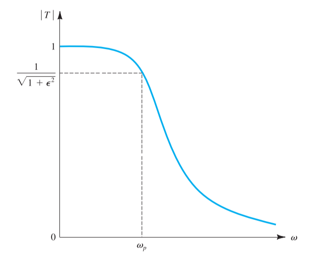

The figure above shows a sketch of Butterworth filter and the **magnitude function** for an N-th Butterworth filter with a bandpass edge $\omega_p$ is given as

$$
\|T(j\omega)\| = \frac{1}{\sqrt{1+\epsilon^2\big(\frac{\omega}{\omega_p}\big)^2}}
$$

At the frequency of $\omega_p$

$$
\|T(j\omega)\| = \frac{1}{\sqrt{1+\epsilon^2}}
$$

Then the parameter $\epsilon$ determines $A_{max}$

$$
\begin{aligned}
    A_{max} &= 10\log{(1+\epsilon^2)}\\[2ex]
    \epsilon &= \sqrt{10^{A_{max}/10}-1}
\end{aligned}
$$

At the edge of stopband $\omega=\omega_s$, check the attenuation of the filter

$$
A(\omega_s) = 10\log{\Big[1+\epsilon^2(\omega_s/\omega_p)^{2N}\Big]}
$$

Find the lowest filter order $N$ such that $A(\omega_s)>A_{min}$

Then the transfer function could be written as

$$
T(s) = \frac{K\omega_0^N}{(s-p_1)(s-p_2)\cdots(s-p_N)}
$$

- $\omega_0=\omega_p(1/\epsilon)^{1/N}$

### Chebyshev Filter

The figure above shows a sketch of Chebyshev filter and the **magnitude function** for an N-th Chebyshev filter with a bandpass edge $\omega_p$ is given as

$$
\|T(j\omega)\| =
\begin{cases}
 \frac{1}{\sqrt{1+\epsilon^2\cos^2[N\cos^{-1}(\omega/\omega_p)]}} \qquad \omega <\omega_p\\[2ex]
 \frac{1}{\sqrt{1+\epsilon^2\cosh^2[N\cosh^{-1}(\omega/\omega_p)]}} \qquad \omega >\omega_p
\end{cases}
$$

At the frequency of $\omega_p$

$$
\|T(j\omega)\| = \frac{1}{\sqrt{1+\epsilon^2}}
$$

Then the parameter $\epsilon$ determines $A_{max}$

$$
\begin{aligned}
    A_{max} &= 20\log{\sqrt{1+\epsilon^2}}\\[2ex]
    \epsilon &= \sqrt{10^{A_{max}/10}-1}
\end{aligned}
$$

At the edge of stopband $\omega=\omega_s$, check the attenuation of the filter

$$
A(\omega_s) = 10\log{\Big[1+\epsilon^2\cosh^2(N\cosh^{-1}(\omega_s/\omega_p))\Big]}
$$

Find the lowest filter order $N$ such that $A(\omega_s)>A_{min}$

And the poles of the Chebyshev filter are given by

$$
\begin{aligned}
    p_k = &-\omega_p\sin\Big(\frac{2k-1}{N}\frac{\pi}{2}\Big)\sinh\Big(\frac{1}{N}\sinh^{-1}\frac{1}{\epsilon}\Big)\\[2ex]
     &+j\omega_p\cos\Big(\frac{2k-1}{N}\frac{\pi}{2}\Big)\cosh\Big(\frac{1}{N}\sinh^{-1}\frac{1}{\epsilon}\Big)\qquad k = 1,2,\cdots,N
\end{aligned}
$$

Then the transfer function could be written as

$$
T(s) = \frac{K\omega_p^N}{\epsilon 2^{N-1}(s-p_1)(s-p_2)\cdots(s-p_N)}
$$

- $\omega_0=\omega_p(1/\epsilon)^{1/N}$

## 6-4 First-Order and Second-Order Filter Functions

### First Order Filters

The general first-order transfer function is given by

$$
T(s) = \frac{a_1s+a_0}{s+\omega_0}
$$

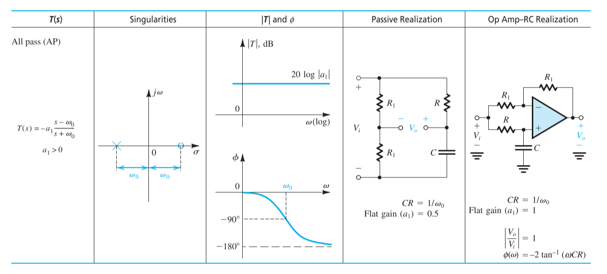

### Second Order Filters

The general second-order transfer function is given by

$$
T(s) = \frac{a_2s^2+a_1s+a_0}{s^2+(\omega_0/Q)s+\omega_0^2}
$$

where $\omega_0$ and $Q$ determines the natural poles

$$
p_{1,2} = -\frac{\omega_0}{2Q}\pm j\omega_0\sqrt{1-(1/4Q^2)}
$$

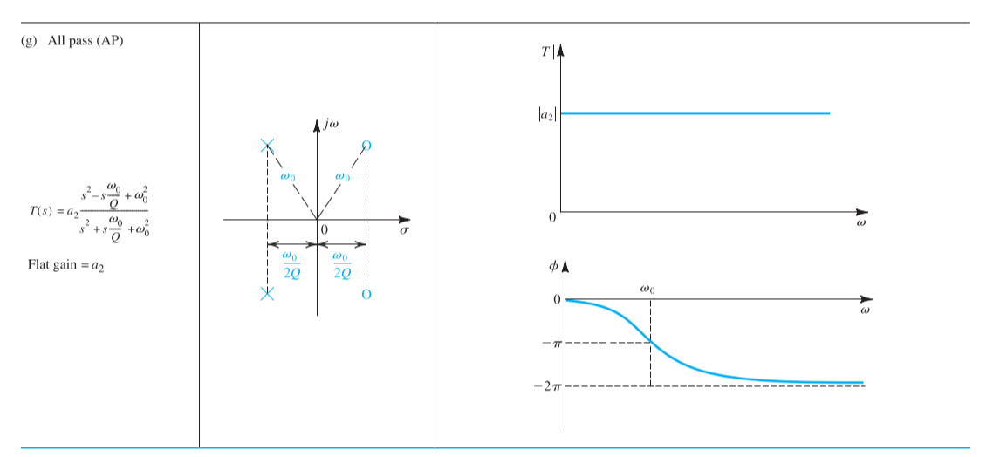

## 6-5 Second-Order LCR Resonator

### Resonator Natural Mode

$$
\begin{aligned}
    \frac{V_o}{I} &= \frac{1}{Y} = \frac{1}{(1/sL)+sC+(1/R)}\\[2ex]
                  &= \frac{s/C}{s^2+s(1/CR)+(1/LC)} = \frac{}{s^2+s(\omega_0/Q)+\omega_0^2}
\end{aligned}
$$

Where we could get that

$$
\begin{aligned}
    \omega_0 &= \frac{1}{\sqrt{LC}}\\[2ex]
    Q &= \omega_0 CR
\end{aligned}
$$

### Realization of the Various Filter Types

#### Low-Pass Function

$$
T(s) = \frac{Z_2}{Z_1+Z_2} = \frac{\omega_0^2}{s^2+s(\omega_0/Q)+\omega_0^2}
$$

> 2nd-order low-pass filters have **2 zeros** at $\infty$

#### High-Pass Function

$$
T(s) = \frac{Z_2}{Z_1+Z_2} = \frac{s^2}{s^2+s(\omega_0/Q)+\omega_0^2}
$$

> 2nd-order high-pass filters have **2 zeros** at $s=0$

#### Band-Pass Function

$$
T(s) = \frac{Z_2}{Z_1+Z_2} = \frac{(\omega_0/Q)s}{s^2+s(\omega_0/Q)+\omega_0^2}
$$

> 2nd-order band-pass filters have **1 zero** at $\infty$ and **1 zero** at $s=0$

#### Notch Function

$$
T(s) = \frac{Z_2}{Z_1+Z_2} = a_2\frac{s^2+\omega_0^2}{s^2+s(\omega_0/Q)+\omega_0^2}
$$

> 2nd-order notch(bandstop) filters have **2 zeros** at $j\omega$ axis

## 6-6 Second-Order Active Filters Based on Inductor Replacement

### Antoniou Inductance-Simulation Circuit

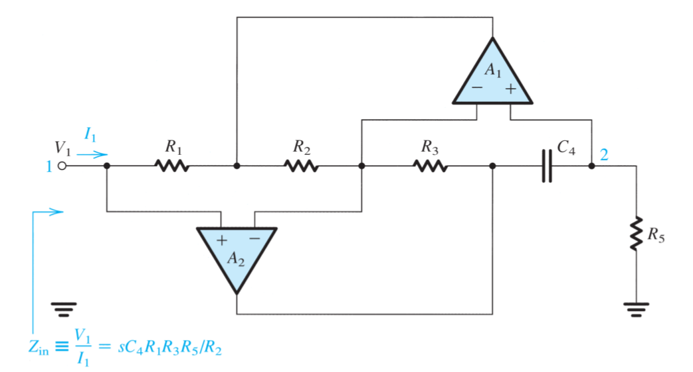

If the circuit is fed at its input (node 1) with a voltage source $V_1$ and the input current is denoted $I_1$, then for the ideal op amp the input impedance is

$$
Z_{in} = \frac{V_1}{I_1} = s\frac{C_4R_1R_3R_5}{R_2}
$$

which gives the inductance

$$
L = \frac{C_4R_1R_3R_5}{R_2}
$$

The design of the circuit is usually selecting $R_1=R_2=R_3=R_5=R$ and $C_4=C$, which leads to $L = CR^2$

### Op Amp-RC Resonator

The circuit is a second-resonator having a pole frequency

$$
\omega_0 = 1/\sqrt{LC_6}=\sqrt{R_2/C_4C_6R_1R_3R_5}
$$

And the quality factor of

$$
Q = \omega_0 C_6 R_6 = R_6 \sqrt{\frac{C_6}{C_4}\frac{R_2}{R_1R_3R_5}}
$$

By selecting $C_4=C_6=C$ and $R_1=R_2=R_3=R_5=R$

$$
\begin{aligned}
    \omega_0 &= 1/CR\\[2ex]
    Q &= R_6/R
\end{aligned}
$$

### Realization of the Various Filter Types

## 6-7 Second-Order Active Filters Based on the Two-Integrator-Loop Topology

### Derivation of the Two-Integrator-Loop Biquad

Consider the second-order high-pass transfer function

$$
\frac{V_{hp}}{V_i} = \frac{Ks^2}{s^2+s(\omega_0/Q)+\omega_0^2}
$$

Dividing both sides with $s^2$

$$
V_{hp}+\frac{1}{Q}\frac{\omega_0}{s}V_{hp}+\frac{\omega_0^2}{s^2}V_{hp}=KV_i
$$

Reexpressing $V_{hp}$ in terms of its single- and double-integrated versions and $V_i$

$$
V_{hp}=KV_i-\frac{1}{Q}\frac{\omega_0}{s}V_{hp}-\frac{\omega_0^2}{s^2}V_{hp}
$$

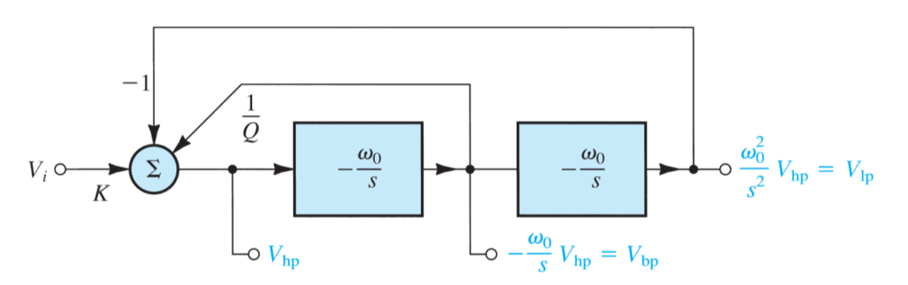

### Circuit Implementation (KHN Biquad)

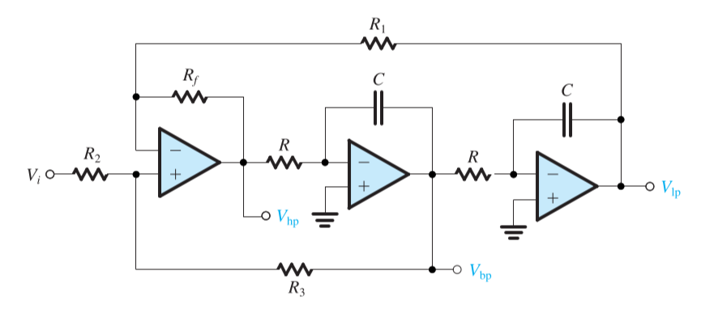

$$
\begin{aligned}
    V_{hp} &= V_i \frac{R_3}{R_2+R_3}\Big(1+\frac{R_f}{R_1}\Big)+V_{bp}\frac{R_2}{R_2+R3}\Big(1+\frac{R_f}{R_1}\Big)-V_{lp}\frac{R_f}{R_1}\\[2ex]
           &= V_i \frac{R_3}{R_2+R_3}\Big(1+\frac{R_f}{R_1}\Big)+\Big(-\frac{\omega_0}{s}V_{hp}\Big)\frac{R_2}{R_2+R3}\Big(1+\frac{R_f}{R_1}\Big)-\Big(\frac{\omega_0^2}{s^2}V_{hp}\Big)\frac{R_f}{R_1}\\[2ex]
\end{aligned}
$$

- $CR=1/\omega_0$
- $R_f=R_1$
- $R_3/R_2=2Q-1$
- $K=2-(1/Q)$

$$
\begin{aligned}
    V_o &= -(\frac{R_F}{R_H}V_{hp}+\frac{R_F}{R_B}V_{bp}+\frac{R_F}{R_L}V_{lp})\\[2ex]
        &= -V_i(\frac{R_F}{R_H}T_{hp}+\frac{R_F}{R_B}T_{bp}+\frac{R_F}{R_L}T_{lp})\\[2ex]
    \frac{V_o}{V_i} &= -K\frac{(R_F/R_H)s^2-s(R_F/R_B)\omega_0+(R_F/R_L)\omega_0^2}{s^2+s(\omega_0/Q)+\omega_0^2}
\end{aligned}
$$

### An Alternative Implementation (Tow–Thomas Biquad)

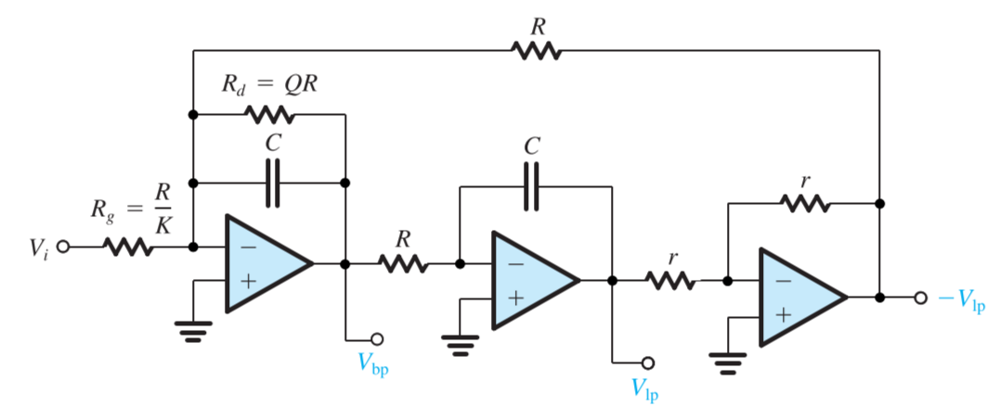

$$
\frac{V_o}{V_i} = -\frac{s^2\big(\frac{C_1}{C}\big)+s\frac{1}{C}\big(\frac{1}{R_1}-\frac{r}{RR_3}\big)+\frac{1}{C^2RR_2}}{s^2+s\frac{1}{QCR}+\frac{1}{C^2R^2}}
$$

- $r=\text{arbitrary}$
- $C=\text{arbitrary}$
- $R=1/\omega_0$

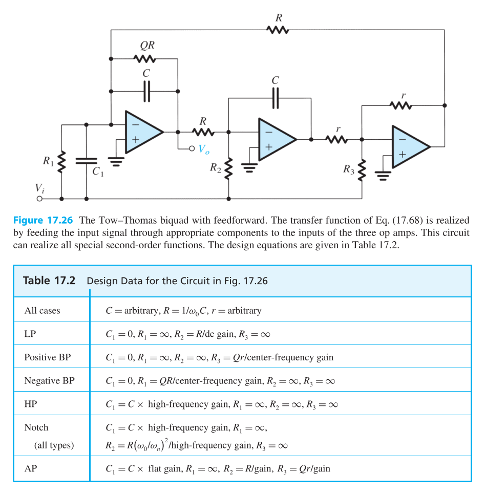
